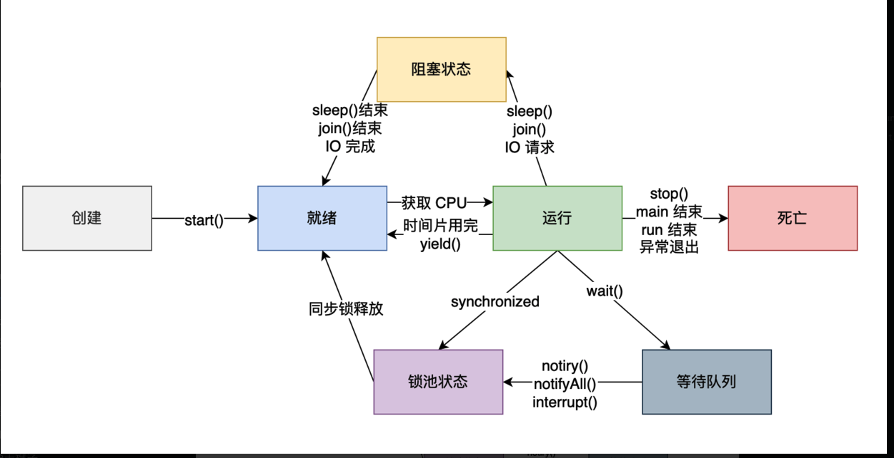

# 多线程

一个进程可以有多个线程

# 创建线程的三种方式

## 继承 Thread 类
继承 Thread 无法获得执行结果，且无法重复继承别的类
```java
public class MyThread extends Thread {
    @Override
    public void run() {
        for (int i = 0; i < 100; i++) {
            System.out.println(getName() + ":打了" + i + "个小兵");
        }
    }
}
//创建MyThread对象
MyThread t1=new  MyThread();
MyThread t2=new  MyThread();
MyThread t3=new  MyThread();
//设置线程的名字
t1.setName("鲁班");
t2.setName("刘备");
t3.setName("亚瑟");
//启动线程
t1.start();
t2.start();
t3.start();
```

## 实现 Runnable 接口
Runnable 无法获得执行结果
```java
public class MyRunnable implements Runnable {
    @Override
    public void run() {
        for (int i = 0; i < 10; i++) {
            try {//sleep会发生异常要显示处理
                Thread.sleep(20);//暂停20毫秒
            } catch (InterruptedException e) {
                e.printStackTrace();
            }
            System.out.println(Thread.currentThread().getName() + "打了:" + i + "个小兵");
        }
    }
}
//创建MyRunnable类
MyRunnable mr = new MyRunnable();
//创建Thread类的有参构造,并设置线程名
Thread t1 = new Thread(mr, "张飞");
Thread t2 = new Thread(mr, "貂蝉");
Thread t3 = new Thread(mr, "吕布");
//启动线程
t1.start();
t2.start();
t3.start();
```

## 实现 Callable 接口
```java
public class CallerTask implements Callable<String> {
    public String call() throws Exception {
        return "Hello,i am running!";
    }

    public static void main(String[] args) {
        //创建异步任务
        FutureTask<String> task=new FutureTask<String>(new CallerTask());
        //启动线程
        new Thread(task).start();
        try {
            //等待执行完成，并获取返回结果
            String result=task.get();
            System.out.println(result);
        } catch (InterruptedException e) {
            e.printStackTrace();
        } catch (ExecutionException e) {
            e.printStackTrace();
        }
    }
}

```

# run 方法和 start 方法有什么区别？
- run()：封装线程执行的代码，直接调用相当于调用普通方法。
- start()：启动线程，然后由 JVM 调用此线程的 run() 方法。

# 控制线程的其他方法

## sleep()
使当前正在执行的线程暂停指定的毫秒数，也就是进入休眠的状态。 sleep 的时候要对异常进行处理

## join()
等待这个线程执行完才会轮到后续线程得到 cpu 的执行权，使用这个也要捕获异常

## setDaemon()
将此线程标记为守护线程，准确来说，就是服务其他的线程，像 Java 中的垃圾回收线程，就是典型的守护线程。

## yield()
yield() 方法是一个静态方法，用于暗示当前线程愿意放弃其当前的时间片，允许其他线程执行。然而，它只是向线程调度器提出建议，调度器可能会忽略这个建议。具体行为取决于操作系统和 JVM 的线程调度策略。




# 获取线程的执行结果
Java 1.5 提供了 Callable、Future、FutureTask，它们可以在任务执行完后得到执行结果。

## 有返回值的 Callable
```java
public interface Callable<V> {
    V call() throws Exception;
}
```
`ExecutorService` 是一个接口，位于 `java.util.concurrent` 包下，它是 Java 线程池框架的核心接口，用来异步执行任务。它提供了一些关键方法用来进行线程管理。
```java
// 创建一个包含5个线程的线程池
ExecutorService executorService = Executors.newFixedThreadPool(5);

// 创建一个Callable任务
Callable<String> task = new Callable<String>() {
    public String call() {
        return "Hello from " + Thread.currentThread().getName();
    }
};

// 提交任务到ExecutorService执行，并获取Future对象
Future[] futures = new Future[10];
for (int i = 0; i < 10; i++) {
    futures[i] = executorService.submit(task);
}

// 通过Future对象获取任务的结果
for (int i = 0; i < 10; i++) {
    System.out.println(futures[i].get());
}

// 关闭ExecutorService，不再接受新的任务，等待所有已提交的任务完成
executorService.shutdown();

```

## 异步计算结果 Future 接口
Future 位于 java.util.concurrent 包下，它是一个接口
```java
public interface Future<V> {
    boolean cancel(boolean mayInterruptIfRunning);
    boolean isCancelled();
    boolean isDone();
    V get() throws InterruptedException, ExecutionException;
    V get(long timeout, TimeUnit unit)
        throws InterruptedException, ExecutionException, TimeoutException;
} 
```
- cancel() 方法用来取消任务
- isCancelled() 方法表示任务是否被取消成功
- isDone() 表示任务是否已经完成
- get() 获取执行结果，这个方法会产生阻塞，会一直等到任务执行完毕才返回
- get(long timeout, TimeUnit unit)用来获取执行结果，如果在指定时间内，还没获取到结果，就直接返回 null。

我们通过 `Executors` 工具类来创建一个 `ExecutorService`，然后向里面提交 `Callable` 任务，然后通过 `Future` 来获取执行结果。

```java
// 创建一个包含5个线程的线程池
ExecutorService executorService = Executors.newFixedThreadPool(5);

// 创建一个Callable任务
Callable<String> task = new Callable<String>() {
    public String call() {
        return "Hello from " + Thread.currentThread().getName();
    }
};

// 提交任务到ExecutorService执行，并获取Future对象
Future[] futures = new Future[10];
for (int i = 0; i < 10; i++) {
    futures[i] = executorService.submit(task);
}

// 通过Future对象获取任务的结果
for (int i = 0; i < 10; i++) {
    System.out.println(futures[i].get());
}

// 关闭ExecutorService，不再接受新的任务，等待所有已提交的任务完成
executorService.shutdown();

```

## 异步计算结果 FutureTask 实现类
看一下 FutureTask 的实现
```java
// FutureTask 类实现了 RunnableFuture 接口
public class FutureTask<V> implements RunnableFuture<V>

// RunnableFuture 的实现
public interface RunnableFuture<V> extends Runnable, Future<V> {
    void run();
}
```
`RunnableFuture` 继承了 `Runnable` 接口和 `Future` 接口，而 `FutureTask` 实现了 `RunnableFuture` 接口。所以它既可以作为 `Runnable` 被线程执行，又可以作为 `Future` 得到 `Callable` 的返回值。

FutureTask 提供了 2 个构造器
```java
public FutureTask(Callable<V> callable) {
}
public FutureTask(Runnable runnable, V result) {
}
```
当需要异步执行一个计算并在稍后的某个时间点获取其结果时，就可以使用 FutureTask。
```java
// 创建一个固定大小的线程池
ExecutorService executorService = Executors.newFixedThreadPool(3);

// 创建一系列 Callable
Callable<Integer>[] tasks = new Callable[5];
for (int i = 0; i < tasks.length; i++) {
    final int index = i;
    tasks[i] = new Callable<Integer>() {
        @Override
        public Integer call() throws Exception {
            TimeUnit.SECONDS.sleep(index + 1);
            return (index + 1) * 100;
        }
    };
}

// 将 Callable 包装为 FutureTask，并提交到线程池
FutureTask<Integer>[] futureTasks = new FutureTask[tasks.length];
for (int i = 0; i < tasks.length; i++) {
    futureTasks[i] = new FutureTask<>(tasks[i]);
    executorService.submit(futureTasks[i]);
}

// 获取任务结果
for (int i = 0; i < futureTasks.length; i++) {
    System.out.println("Result of task" + (i + 1) + ": " + futureTasks[i].get());
}

// 关闭线程池
executorService.shutdown();

/**
 * 结果
  Result of task1: 100
  Result of task2: 200
  Result of task3: 300
  Result of task4: 400
  Result of task5: 500
 */
```