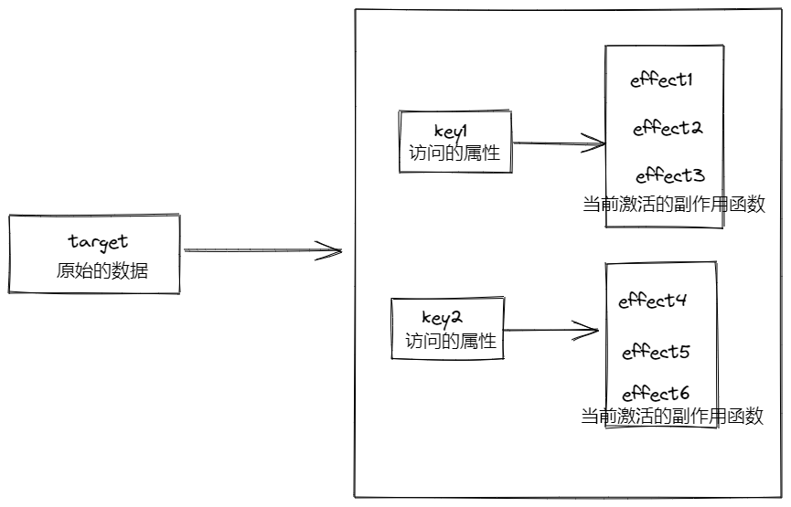

# Vue3 的响应式模块 reactivity

一张图来看一下整个响应式 API 实现和组件更新的关系：


它和 `Vue.js 2.x` 的响应式原理图很接近，其实 `Vue.js 3.0` 在响应式的实现思路和 `Vue.js 2.x` 差别并不大，**主要就是 劫持数据的方式改成用 `Proxy` 实现 ， 以及收集的依赖由 `watcher` 实例变成了组件副作用渲染函数 。**

## reactive API

在 Vue3 里通过 `reactive`, 利用新的 `Proxy`来代理数据, 检测数据的`Setter`和`getter` 。

- 由用户主动申明响应式的变量(避免初始阶段`Object.defineProperty`的递归性能损耗)
- Proxy 更高效,范围更广, 监听对象属性新增和删除.

[reactive 源码](https://github.com/vuejs/vue-next/blob/87c86e4cc29ce3d09c11f27c7ba0eb13e7353b6c/packages/reactivity/src/reactive.ts#L173)

```js
export function reactive(target: object) {
  // if trying to observe a readonly proxy, return the readonly version.
  if (target && (target as Target)[ReactiveFlags.IS_READONLY]) {
    return target
  }
  return createReactiveObject(
    target,
    false,
    mutableHandlers,
    mutableCollectionHandlers,
    reactiveMap
  )
}
function createReactiveObject(
  target: Target,
  isReadonly: boolean,
  baseHandlers: ProxyHandler<any>,
  collectionHandlers: ProxyHandler<any>,
  proxyMap: WeakMap<Target, any>
) {
  if (!isObject(target)) {
    if (__DEV__) {
      console.warn(`value cannot be made reactive: ${String(target)}`)
    }
    return target
  }
  // target is already a Proxy, return it.
  // exception: calling readonly() on a reactive object
  if (
    target[ReactiveFlags.RAW] &&
    !(isReadonly && target[ReactiveFlags.IS_REACTIVE])
  ) {
    return target
  }
  // target already has corresponding Proxy
  const existingProxy = proxyMap.get(target)
  if (existingProxy) {
    return existingProxy
  }
  // only a whitelist of value types can be observed.
  // 原始数据 target 必须是对象或者数组。
  const targetType = getTargetType(target)
  if (targetType === TargetType.INVALID) {
    return target
  }
  const proxy = new Proxy(
    target,
    targetType === TargetType.COLLECTION ? collectionHandlers : baseHandlers
  )
  proxyMap.set(target, proxy)
  return proxy
}
```

这里在劫持数据之前,做了一些判断. 如:

- 判断是否是 readonly 数据(只读)
- 判断是否已经是响应式数据
- 判断是否可以 observed (原始数据 target 必须是对象或者数组)
- 最后, `Proxy` 劫持数据, 并打上标记, 已经被响应式

接着看一下`Proxy`的处理器对象. `baseHandlers` 在 `reactive`函数中传入的是 `mutableHandlers`:

[mutableHandlers](https://github.com/vuejs/vue-next/blob/87c86e4cc2/packages/reactivity/src/baseHandlers.ts#L200)

```js
export const mutableHandlers: ProxyHandler<object> = {
  get, //访问对象属性会触发 get 函数；
  set, //设置对象属性会触发 set 函数；
  deleteProperty, //删除对象属性会触发 deleteProperty 函数；
  has, //in 操作符会触发 has 函数；
  ownKeys, //通过 Object.getOwnPropertyNames 访问对象属性名会触发 ownKeys 函数。
};
```

这里劫持了我们对 observed 对象的一些操作, 但是 无论命中哪个处理器函数，它都会做依赖收集和派发通知这两件事其中的一个，所以这里我只要分析常用的 get 和 set 函数.

## 依赖收集：get 函数

好的，现在又回到了熟悉的依赖收集环节 :

```js
function createGetter(isReadonly = false) {
  return function get(target, key, receiver) {
    if (key === '__v_isReactive' /* isReactive */) {
      // 代理 observed.__v_isReactive
      return !isReadonly;
    } else if (key === '__v_isReadonly' /* isReadonly */) {
      // 代理 observed.__v_isReadonly
      return isReadonly;
    } else if (key === '__v_raw' /* raw */) {
      // 代理 observed.__v_raw
      return target;
    }
    const targetIsArray = isArray(target);
    // arrayInstrumentations 包含对数组一些方法修改的函数
    // 'includes', 'indexOf', 'lastIndexOf'
    if (targetIsArray && hasOwn(arrayInstrumentations, key)) {
      return Reflect.get(arrayInstrumentations, key, receiver);
    }
    // 求值 Reflect 的主要作用就是当你改写这些方法的时候，让你能够调用原方法。
    const res = Reflect.get(target, key, receiver);
    // 内置 Symbol key 不需要依赖收集
    if ((isSymbol(key) && builtInSymbols.has(key)) || key === '__proto__') {
      return res;
    }
    // 依赖收集
    !isReadonly && track(target, 'get' /* GET */, key);
    return isObject(res)
      ? isReadonly
        ? readonly(res)
        : // 如果 res 是个对象或者数组类型，则递归执行 reactive 函数把 res 变成响应式
          reactive(res)
      : res;
  };
}

const arrayInstrumentations = {}[('includes', 'indexOf', 'lastIndexOf')].forEach(key => {
  arrayInstrumentations[key] = function (...args) {
    // toRaw 可以把响应式对象转成原始数据
    const arr = toRaw(this);
    for (let i = 0, l = this.length; i < l; i++) {
      // 依赖收集
      track(arr, 'get' /* GET */, i + '');
    }
    // 先尝试用参数本身，可能是响应式数据
    const res = arr[key](...args);
    if (res === -1 || res === false) {
      // 如果失败，再尝试把参数转成原始数据
      return arr[key](...args.map(toRaw));
    } else {
      return res;
    }
  };
});
```

- 首先对特殊的 key 做处理
- 是数组,且命中那 `includes, indexOf, lastIndexOf`这三个方法, 除了调用数组本身的方法求值外, 还对数组每个元素做了依赖收集。因为一旦数组的元素被修改，数组的这几个 API 的返回结果都可能发生变化，所以我们需要跟踪数组每个元素的变化
- `Reflect.get` 求值, Reflect 的主要作用就是当你改写这些方法的时候，让你能够调用原方法。(元编程的概念)
- **执行 track 函数收集依赖**
- 通过`Reflect.get`求值的结果, 如果是 res 是个对象或者数组类型，则递归执行 reactive 函数把 res 变成响应式(延时定义子对象响应式,提升性能)

看一下`track`函数的实现:

我们先想一下要收集的依赖是什么，我们的目的是实现响应式，就是当数据变化的时候可以自动做一些事情，比如执行某些函数，**所以我们收集的依赖就是数据变化后执行的副作用函数。**

```js
function track(target, type, key) {
  if (!isTracking()) {
    return;
  }
  let depsMap = targetMap.get(target);
  if (!depsMap) {
    // 每个 target 对应一个 depsMap
    targetMap.set(target, (depsMap = new Map()));
  }
  let dep = depsMap.get(key);
  if (!dep) {
    // 每个 key 对应一个 dep 集合
    depsMap.set(key, (dep = createDep()));
  }
  const eventInfo = process.env.NODE_ENV !== 'production' ? { effect: activeEffect, target, type, key } : undefined;
  trackEffects(dep, eventInfo);
}

function trackEffects(dep, debuggerEventExtraInfo) {
  // 是否应该收集依赖
  let shouldTrack = false;
  if (effectTrackDepth <= maxMarkerBits) {
    // 在 dep 把前激活的 effect 作为依赖收集前，会判断这个 dep 是否已经被收集，如果已经被收集，则不需要再次收集
    if (!newTracked(dep)) {
      // 标记为新依赖
      dep.n |= trackOpBit;
      // 如果依赖已经被收集，则不需要再次收集
      shouldTrack = !wasTracked(dep);
    }
  } else {
    // cleanup 模式
    shouldTrack = !dep.has(activeEffect);
  }
  if (shouldTrack) {
    // 收集当前激活的 effect 作为依赖
    dep.add(activeEffect);
    // 当前激活的 effect 收集 dep 集合作为依赖
    activeEffect.deps.push(dep);
    if (process.env.NODE_ENV !== 'production' && activeEffect.onTrack) {
      activeEffect.onTrack(
        Object.assign(
          {
            effect: activeEffect,
          },
          debuggerEventExtraInfo
        )
      );
    }
  }
}
```

我们把 `target` 作为原始的数据，key 作为访问的属性。我们创建了全局的 `targetMap` 作为原始数据对象的 `Map`，它的键是 `target`，值是 `depsMap`，作为依赖的 `Map`；这个 `depsMap` 的键是 `target` 的 `key`，值是 `dep` 集合，`dep` 集合中存储的是依赖的副作用函数



[设置当前激活的副作用函数](https://github.com/vuejs/vue-next/blob/61720231b48dc57eeda8930eae11b5a03d9210a3/packages/reactivity/src/effect.ts#L101)

每次 track ，就是把当前激活的副作用函数 activeEffect 作为依赖，然后收集到 target 相关的 depsMap 对应 key 下的依赖集合 dep 中.

## 派发通知：set 函数

派发通知发生在数据更新的阶段 ，由于我们用 Proxy API 劫持了数据对象，所以当这个响应式对象属性更新的时候就会执行 set 函数

```js
function createSetter() {
  return function set(target, key, value, receiver) {
    const oldValue = target[key];
    value = toRaw(value);
    const hadKey = hasOwn(target, key);
    const result = Reflect.set(target, key, value, receiver);
    // 如果目标的原型链也是一个 proxy，通过 Reflect.set 修改原型链上的属性会再次触发 setter，这种情况下就没必要触发两次 trigger 了
    if (target === toRaw(receiver)) {
      if (!hadKey) {
        trigger(target, 'add' /* ADD */, key, value);
      } else if (hasChanged(value, oldValue)) {
        trigger(target, 'set' /* SET */, key, value, oldValue);
      }
    }
    return result;
  };
}
```

set 函数的实现逻辑很简单，主要就做两件事情， 首先通过 Reflect.set 求值 ， 然后通过 trigger 函数派发通知 ，并依据 key 是否存在于 target 上来确定通知类型，即新增还是修改。

核心部分是**执行 trigger 函数派发通知**, **每次 trigger 函数就是根据 target 和 key ，从 targetMap 中找到相关的所有副作用函数遍历执行一遍。**

```js
// 原始数据对象 map
const targetMap = new WeakMap();
export function trigger(
  target: object,
  type: TriggerOpTypes,
  key?: unknown,
  newValue?: unknown,
  oldValue?: unknown,
  oldTarget?: Map<unknown, unknown> | Set<unknown>
) {
  // 从依赖管理中心中获取依赖
  const depsMap = targetMap.get(target)
  // 没有被收集过的依赖，直接返回
  if (!depsMap) {
    return
  }

  let deps: (Dep | undefined)[] = []
  // 触发trigger 的时候传进来的类型是清除类型
  if (type === TriggerOpTypes.CLEAR) {
    // 往队列中添加关联的所有依赖，准备清除
    deps = [...depsMap.values()]
  } else if (key === 'length' && isArray(target)) {
    // 如果是数组类型的，并且是数组的 length 改变时
    depsMap.forEach((dep, key) => {
      // 如果数组长度变短时，需要做已删除数组元素的 effects 和 trigger
      // 也就是索引号 >= 数组最新的length的元素们对应的 effects，要将它们添加进队列准备清除
      if (key === 'length' || key >= (newValue as number)) {
        deps.push(dep)
      }
    })
  } else {
    // 如果 key 不是 undefined，就添加对应依赖到队列，比如新增、修改、删除
    if (key !== void 0) {
      deps.push(depsMap.get(key))
    }
    // 新增、修改、删除分别处理
    switch (type) {
      case TriggerOpTypes.ADD: // 新增
        ...
        break
      case TriggerOpTypes.DELETE: // 删除
        ...
        break
      case TriggerOpTypes.SET: // 修改
        ...
        break
    }
  }
  // 到这里就拿到了 targetMap[target][key]，并存到 deps 里
  // 接着是要将对应的 effect 取出，调用 triggerEffects 执行

  // 判断开发环境，传入eventInfo
  const eventInfo = __DEV__
    ? { target, type, key, newValue, oldValue, oldTarget }
    : undefined

  if (deps.length === 1) {
    if (deps[0]) {
      if (__DEV__) {
        triggerEffects(deps[0], eventInfo)
      } else {
        triggerEffects(deps[0])
      }
    }
  } else {
    const effects: ReactiveEffect[] = []
    for (const dep of deps) {
      if (dep) {
        effects.push(...dep)
      }
    }
    if (__DEV__) {
      triggerEffects(createDep(effects), eventInfo)
    } else {
      triggerEffects(createDep(effects))
    }
  }
}

export function triggerEffects(
  dep: Dep | ReactiveEffect[],
  debuggerEventExtraInfo?: DebuggerEventExtraInfo
) {
  // 遍历 effect 的集合函数
  for (const effect of isArray(dep) ? dep : [...dep]) {
    /**
      这里判断 effect !== activeEffect的原因是：不能和当前effect 相同
      比如：count.value++，如果这是个effect，会触发getter，track收集了当前激活的 effect，
      然后count.value = count.value+1 会触发setter，执行trigger，
      就会陷入一个死循环，所以要过滤当前的 effect
    */
    if (effect !== activeEffect || effect.allowRecurse) {
      if (__DEV__ && effect.onTrigger) {
        effect.onTrigger(extend({ effect }, debuggerEventExtraInfo))
      }
      // 如果 scheduler 就执行，计算属性有 scheduler
      if (effect.scheduler) {
        effect.scheduler()
      } else {
        // 执行 effect 函数
        effect.run()
      }
    }
  }
}
```

- 通过 targetMap 拿到 target 对应的依赖集合 depsMap；
- 创建运行的 effects 集合
- 根据 key 从 depsMap 中找到对应的 effects 添加到 effects 集合；
- 遍历 effects 执行相关的副作用函数
