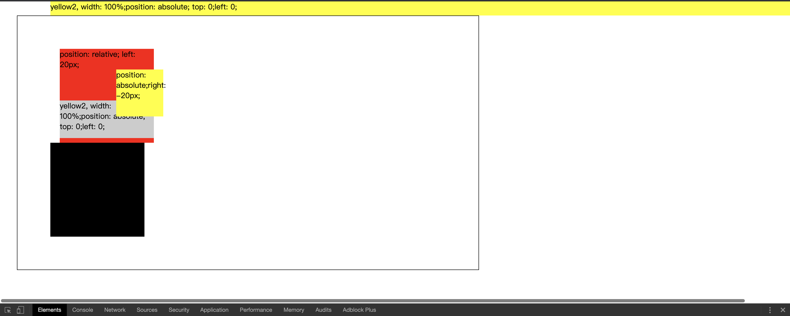

## 定位(position)
position属性允许你定位一个元素，通过使用top，left，bottom，right属改变位置。
常用的position的值有：``static``，``relative``，``absolute``，``fixed``。

#### static
默认值。没有定位，元素出现在标准文档流中（忽略 top, bottom, left, right 或者 z-index 声明）。

#### relative
生成相对定位的元素，相对于其正常位置进行定位。已经脱离标准文档流，但是标准文档流里会留有一个和它一样大小‘影子’，为其占据位置。这时候，z-index是有效的。如果设置了left:20px，就是以这个影子为基准，向右偏移20px。如果设置了left:-20px，就是以这个影子为基准，向左偏移20px。

#### absolute
+ 生成绝对定位的元素，相对于 static 定位以外的第一个父元素进行定位。
+ 如果一个元素设置了``position:absolute;``，它会脱离标准文档流。在标准文档流中不占位置。
+ 它会向上查找父元素，直到找到第一个定位不是 static 的父元素。它的定位（left，top等值）就是根据这个找到的元素确定的。如果在向上没有找到定位不是 static 的父元素，那就是根据html元素定位。
+ z-idnex有效

#### fixed
生成绝对定位的元素，相对于浏览器窗口进行定位。元素的位置通过 "left", "top", "right" 以及 "bottom" 属性进行规定。

下面看例子：
```css
*{
    padding: 0;
    margin: 0;
}
.content{
    width: 200px;
    height: 200px;
}
.box1{
    width: 50%;
    padding: 70px;
    border: 1px solid #000;
    margin: 30px;
    /* box-sizing: border-box; */
}
.box1 .red{
    position: relative;
    left: 20px;
    background: red;
}
.box1>.red>.yellow{
    width: 100px;
    height: 100px;
    position: absolute;
    right: -20px;
    background: yellow;
    z-index: 1;
}
.box1>.red>.ccc{
    width: 100%;
    height: 40%;
    position: absolute;
    bottom: 10px;
    top: initial;/* 默认值 */
    background: #ccc;
}
.box1 .black{
    position: static;
    left: 20px;
    background: black;
}
.box1 .yellow2{
    width: 100%;
    height: 30px;
    position: absolute;
    top: 0;
    /* left: 0; */
    background: yellow;
} 
```
```html
<body>
    <div class="box1">
        <div class="content red">
            position: relative;
            left: 20px;
            <div class="yellow">position: absolute;right: -20px;</div>
            <div class="ccc"> 
                yellow2,  width: 100%;position: absolute;
                top: 0;left: 0;</div>
        </div>
        <div class="content black"></div>
        <div class="yellow2"> 
            yellow2,  width: 100%;position: absolute;
            top: 0;left: 0;</div>
    </div>
</body>
```


##### 红色和黑色盒子
+ 定位为relative的盒子，虽然会脱离文档流，但是会留一个‘影子’占据原来标准文档流的位置。
+ left：20px。

##### 红色和它的子黄色盒子
+ 定位为absolute的元素，向上查找定位不是static的第一个元素即red元素。
+ right:-20px;即相对于red元素向左偏移20px。
+ 没有设置的top，按照标准文档流的位置来。

##### 红色和它的子灰色盒子
+ 灰色盒子定位absolute，它的基准元素为red。
+ 此时宽度100%，就是red的100%。（与下一条结合起来看）
+ z-idnex的用法。如果黄色不加z-index，会被灰色遮挡。

##### box1和顶部yellow2元素
+ yellow2元素是定位为absolute的元素，它的基准盒子向上找定位不是 static 的父元素，但是没有找到。那就是默认的html。
+ 此时注意到，yellow2的width：100%，就是html宽度的100%。但是，box1有padding-left，又没有设置left，所以不是从最左边开始，所以出现滚动条。

##### fixed元素
+ 定位为fixed的元素，是绝对定位。其基准盒子是浏览器可视区域。


###### 例子在demo里面


