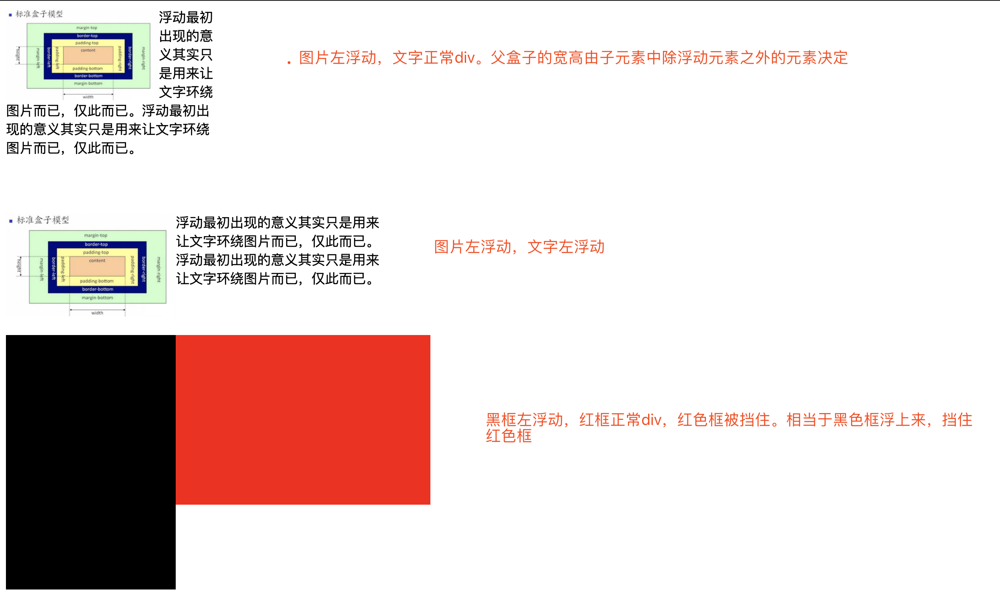

## 浮动
说浮动之前，先说下标准文档流。

#### 标准文档流
文档流指的是元素排版布局过程中，元素会默认自动从左往右，从上往下的流式排列方式。并最终窗体自上而下分成一行行，并在每行中从左至右的顺序排放元素。

#### 什么是浮动
定义：浮动的框可以向左或向右移动，直到它的外边缘碰到包含框或另一个浮动框的边框为止。由于浮动框不在文档的普通流中，所以文档的普通流中的浮动框之后的块框表现得就像浮动框不存在一样。（注意这里是块框而不是内联元素；浮动框只对它后面的元素造成影响）

#### 浮动用来干什么
>浮动最初出现的意义其实只是用来让文字环绕图片而已，仅此而已。

但是目前大部分应用的是左右布局。
+ 为什么要说说浮动之前，先说标准文档流，因为浮动的一个操作是把元素从标准文档流中脱离出来。所以浮动的元素在标准文档流中是不占位置的。
+ 使用float脱离文档流时，其他盒子会无视这个元素，但其他盒子内的文本依然会为这个元素让出位置，环绕在周围(可以说是部分无视)。

下面看一个例子：
```css
/* 第1个盒子 */
.app1>img{
    float: left;
    width: 180px;
}
.app1>div{
    width: 250px;
}
/* 第2个盒子 */
.app2>img{
    float: left;
    width: 200px;
}
.app2>div{
    width: 250px;
    float: left;
}
/* 第3个盒子 */
.box3 .left{
    width: 200px;
    height: 300px;
    background: #000;
    float: left;
}
.box3 .right{
    width: 500px;
    height: 200px;
    background: red;
}
```


#### 清除浮动
在使用浮动的时候，由于浮动会脱离文档流，页面会会出现一些问题。比如：父元素高度不是实际高度（因为忽略了浮动元素）
1. 添加新标签 
``<div style="clear: both;"></div>``
万能方法，比较繁琐，还浪费标签(不推荐)。
2. overflow + zoom方法。这里的clear_float加到父元素（类似BFC，不推荐）
```css
.clear_float{overflow:hidden; zoom:1;}
```
3. after + zoom方法。（这里的clear_float加到父元素，推荐）
```css
.fix{zoom:1;}
.fix:after{display:block; content:'clear'; clear:both; line-height:0; visibility:hidden;}
```
