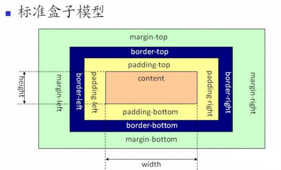
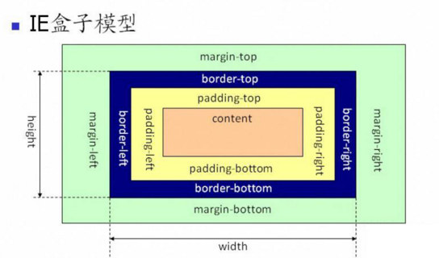

## 盒子模型
在css中盒子模型一般分为标准盒子模型和IE盒子模型，现代浏览器（IE8+，chrome，360等主流）默认使用标准盒子模型。

下面看下这两种盒子模型的区别。
##### 标准盒子模型

```css
box-sizing: content-box; /* (标准的,且是浏览器默认) */
```
如图所示，在标准的盒子模型中，盒子的具体内容的宽度（content），就是设置的width，不包括padding，border的值。也就是说：
```css
.box1{
    width: 100px;
    height: 100px;
    padding: 10px; /* 内边距 */
    margin: 10px; /*  外边距 */
    border: 1px solid #000;
    box-sizing: content-box; /* 默认的 */
}
```
如果box1的样式是如上，那么box1在文档中实际占据的位置是：
占据宽度：border-left + padding-left + width + padding-right + border-right = 122px;
占据高度：border-top + padding-top + height + padding-bottom + border-bottom = 122px;

##### IE盒子模型

```css
box-sizing: border-box; /* IE盒子模型 */
```
如图所示，在IE的盒子模型中，盒子的具体内容的宽度（content），是变化的，如果你设置了padding和border，content的值会相应减小。也就是说：
```css
.box2{
    width: 100px;
    height: 100px;
    padding: 10px; /* 内边距 */
    margin: 10px; /*  外边距 */
    border: 1px solid #000;
    box-sizing: border-box; /* IE盒子模型 */
}
```
如果box2的样式如上，那么box2的实际占据宽度就是固定的width，而它的content：
具体内容的宽度：content = width - border-left - padding-left - border-right - padding-right;

##### 两种盒子优劣
标准盒子的好处在于比较符合人定义元素的宽高度，但IE 盒子更适合布局和表单。 有一个场景会比较常见，比如有两个div，各占50% ， 很明显如果设定padding border margin ，这两个div就不会在一行了。所以IE 盒子更适合布局。

##### 外边距合并
外边距合并指的是，当两个垂直外边距相遇时，它们将形成一个外边距。合并后的外边距的高度等于两个发生合并的外边距的高度中的较大者。
下面说下最常见的两种种情况：
###### 上下盒子

###### 父子盒子

###### 注意
<ul>
<li><p>只有普通文档流中块框的垂直外边距才会发生外边距合并。行内框、浮动框或绝对定位之间的外边距不会合并。</p></li>
<li><p>取消合并只需加boredr或者padding。</p></li>
<li><p>以上例子点击查看</p></li>
</ul>

