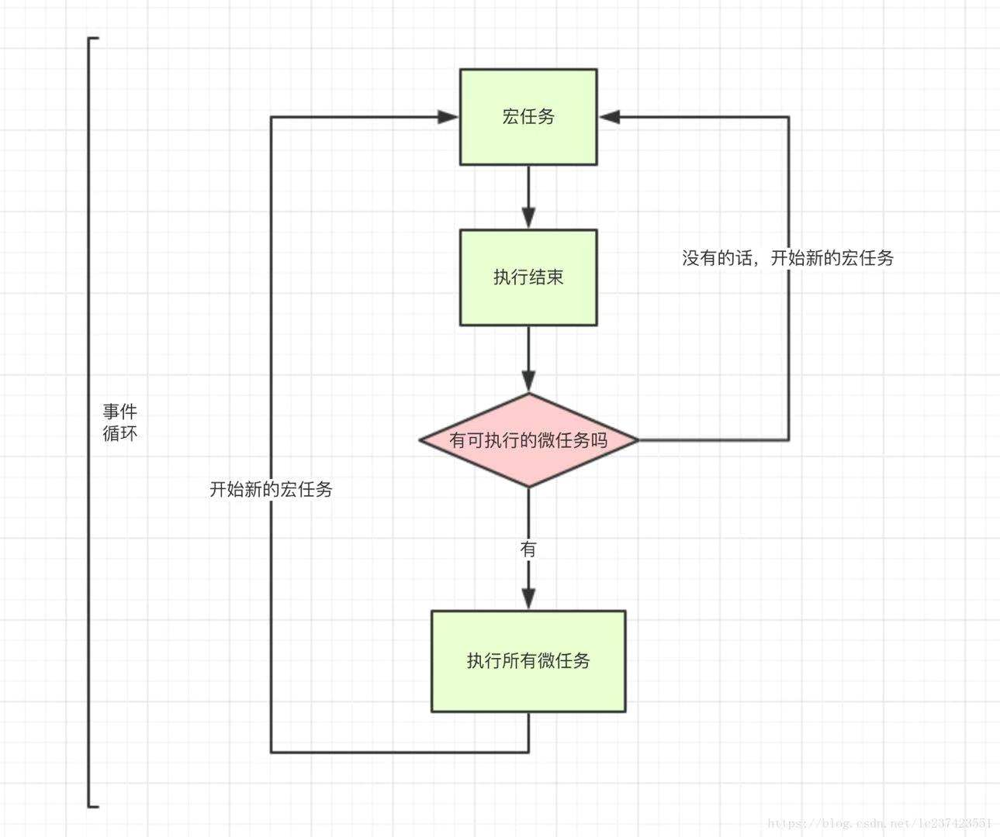

我们把宿主发起的任务称为宏观任务，把JavaScript引擎发起的任务称为微观任务。

## 宏任务
+ script
+ setTimeout
+ setInterval
+ setImmediate
+ I/O
+ UI rendering

## 微任务
+ process.nextTick
+ promises
+ Object.observe
+ MutationObserver

在执行代码的过程中，遇到宏任务挂起一个宏任务队列，遇到promise.then挂起一个微任务队列。每一次的宏任务执行完，把此次宏任务中产生的微任务全部执行。


```js
console.log('script start')

async function async1() {
    await async2()
    console.log('async1 end')
}
async function async2() {
    console.log('async2 end')
    return Promise.resolve().then(()=>{
        console.log('async2 end1')
    })
}
async1()

setTimeout(function() {
    console.log('setTimeout')
}, 0)

new Promise(resolve => {
    console.log('Promise')
    resolve()
})
.then(function() {
    console.log('promise1')
})
.then(function() {
    console.log('promise2')
})

console.log('script end')
```

```js
console.log('script start')

async function async1() {
await async2()
console.log('async1 end')
}
async function async2() {
console.log('async2 end')
}
async1()

setTimeout(function() {
console.log('setTimeout')
}, 0)

new Promise(resolve => {
console.log('Promise')
resolve()
})
.then(function() {
console.log('promise1')
})
.then(function() {
console.log('promise2')
})

console.log('script end')
```

+ [好文](https://mp.weixin.qq.com/s/QgfE5Km1xiEkQqADMLmj-Q)