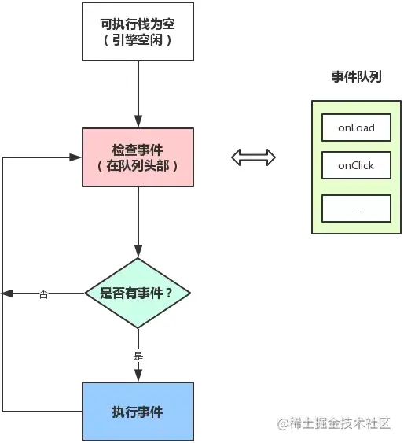

我们把宿主发起的任务称为宏观任务，把 JavaScript 引擎发起的任务称为微观任务。

## 事件循环机制（Event Loop）

事件触发线程管理的任务队列是如何产生的呢？事实上这些任务就是从 JS 引擎线程本身产生的

主线程在运行时会产生执行栈，栈中的代码调用某些异步 API 时会在任务队列中添加事件，栈中的代码执行完毕后，就会读取任务队列中的事件，去执行事件对应的回调函数，如此循环往复，形成事件循环机制

宏任务中的事件是由事件触发线程来维护的
微任务中的所有任务是由 JS 引擎线程维护的（这只是自我猜测，因为宏任务执行完毕后会立即执行微任务，为了提升性能，这种无缝连接的操作放在事件触发线程来维护明显是不合理的）。

根据事件循环机制，重新梳理一下流程：

- 执行一个宏任务（首次执行的主代码块或者任务队列中的回调函数）
- 执行过程中如果遇到微任务，就将它添加到微任务的任务队列中
- 宏任务执行完毕后，立即执行当前微任务队列中的所有任务（依次执行）
- JS 引擎线程挂起，GUI 线程执行渲染
- GUI 线程渲染完毕后挂起，JS 引擎线程执行任务队列中的下一个宏任务



## 宏任务

- script
- setTimeout
- setInterval
- setImmediate
- I/O
- UI rendering

## 微任务

- process.nextTick
- promises
- Object.observe
- MutationObserver

在执行代码的过程中，遇到宏任务挂起一个宏任务队列，遇到 promise.then 挂起一个微任务队列。每一次的宏任务执行完，把此次宏任务中产生的微任务全部执行。


```js
console.log('script start');

async function async1() {
  await async2();
  console.log('async1 end');
}
async function async2() {
  console.log('async2 end');
  return Promise.resolve().then(() => {
    console.log('async2 end1');
  });
}
async1();

setTimeout(function () {
  console.log('setTimeout');
}, 0);

new Promise(resolve => {
  console.log('Promise');
  resolve();
})
  .then(function () {
    console.log('promise1');
  })
  .then(function () {
    console.log('promise2');
  });

console.log('script end');
```

```js
console.log('script start');

async function async1() {
  await async2();
  console.log('async1 end');
}
async function async2() {
  console.log('async2 end');
}
async1();

setTimeout(function () {
  console.log('setTimeout');
}, 0);

new Promise(resolve => {
  console.log('Promise');
  resolve();
})
  .then(function () {
    console.log('promise1');
  })
  .then(function () {
    console.log('promise2');
  });

console.log('script end');
```

- [好文](https://mp.weixin.qq.com/s/QgfE5Km1xiEkQqADMLmj-Q)
