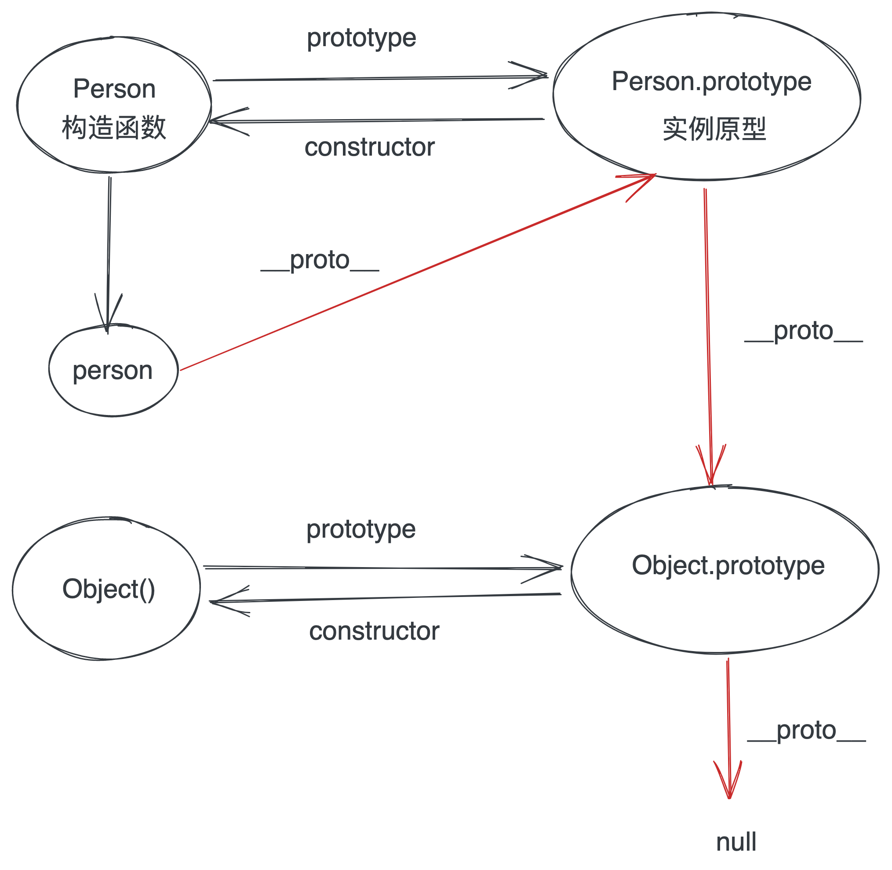

# 原型和原型链



- 函数的 prototype 属性指向了一个对象，这个对象正是调用该构造函数而创建的实例的原型
- 原型：每一个 JavaScript 对象(null 除外)在创建的时候就会与之关联另一个对象，这个对象就是我们所说的原型，每一个对象都会从原型"继承"属性。
- 这是每一个 JavaScript 对象(除了 null)都具有一个`__proto__`，这个属性会指向该对象的原型。
- 当读取实例的属性时，如果找不到，就会查找与对象关联的原型中的属性，如果还查不到，就去找原型的原型，一直找到最顶层为止。

```js
function Person() {}
var person = new Person();
console.log(person.__proto__ === Person.prototype); // true

console.log(Person.prototype.constructor == Person); // true
// 顺便学习一个ES5的方法,可以获得对象的原型
console.log(Object.getPrototypeOf(person) === Person.prototype); // true

console.log(person.constructor === Person); // true
// 当获取 person.constructor 时，其实 person 中并没有 constructor 属性,当不能读取到constructor 属性时，会从 person 的原型也就是 Person.prototype 中读取，正好原型中有该属性
//person.constructor === Person.prototype.constructor
```


# instanceof

> instanceof 运算符用于检测构造函数的 prototype 属性是否出现在某个实例对象的原型链上。

```js
Foo instanceof Object; // true
```

`instanceof` 的执行原理：  
`Foo` 的 `__proto__` 线和 `Object` 的 prototype 线，有交集。即为 `true`.

```js
function new_instance_of(leftVaule, rightVaule) {
  let rightProto = rightVaule.prototype; // 取右表达式的 prototype 值
  leftVaule = leftVaule.__proto__; // 取左表达式的__proto__值
  while (true) {
    if (leftVaule === null) {
      return false;
    }
    if (leftVaule === rightProto) {
      return true;
    }
    leftVaule = leftVaule.__proto__;
  }
}
```

# hasOwnProperty

> hasOwnProperty() 方法会返回一个布尔值，指示对象自身属性中是否具有指定的属性（也就是，是否有指定的键

> 所有继承了 Object 的对象都会继承到 hasOwnProperty 方法。这个方法可以用来检测一个对象是否含有特定的自身属性；和 in 运算符不同，**该方法会忽略掉那些从原型链上继承到的属性**。
