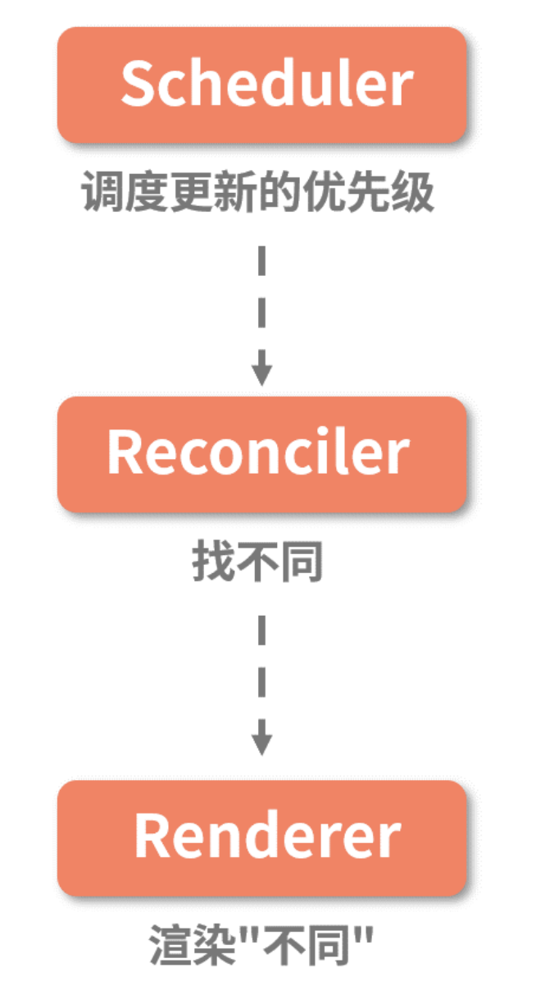

## diff 优化点

从 O(n^3) 到 O(n) 的大前提:

- 若两个组件属于同⼀个类型，那么它们将拥有相同的 DOM 树形结构；
- 处于同⼀层级的⼀组⼦节点，可⽤通过设置 key 作为唯⼀标识，从⽽维持各个节点在不同渲染过程 中的稳定性。

Diff 逻辑的拆分与解读:

- Diff 算法性能突破的关键点在于“分层对⽐”；(分层递归) ( 改变时间复杂度量级的决定性思路)
- 类型⼀致的节点才有继续 Diff 的必要性；
- key 属性的设置，可以帮我们尽可能重⽤同⼀层级内的节点。

## React 16 Fiber 架构

上述 diff 算法虽然足够先进，但是 却是是一条不能中断的路，由于浏览器一帧（16.6ms）, 当 JS 执行时间过长，超出了 16.6ms，这次刷新就没有时间执行样式布局和样式绘制了，Stack Reconciler 需要的调和时间会很⻓，这就意味着 JavaScript 线程将⻓时间地霸占主线 程，进⽽导致我们上⽂中所描述的渲染卡顿/卡死、交互⻓时间⽆响应等问题。 所以 Fiber 架构 因运而生。

Fiber 就是⽐线程还要纤细的⼀个过程，也就是所 谓的“纤程”。纤程的出现，意在对渲染过程实现更加精细的控制。

- 从架构⻆度来看，Fiber 是对 React 核⼼算法（即调和过程）的重写；
- 从编码⻆度来看，Fiber 是 React 内部所定义的⼀种数据结构，它是 Fiber 树结构的节点单位，也就是 React 16 新架构下的“虚拟 DOM”；
- 从⼯作流的⻆度来看，Fiber 节点保存了组件需要更新的状态和副作 ⽤，⼀个 Fiber 同时也对应着⼀个⼯作单元

Fiber 架构的应⽤⽬的，按照 React 官⽅的说法，是实现“增量渲染”。所谓“增量渲染”，通俗来说就 是把⼀个渲染任务分解为多个渲染任务，⽽后将其分散到多个帧⾥⾯。不过严格来说，增量渲染其实 也只是⼀种⼿段，实现增量渲染的⽬的，是为了实现任务的可中断、可恢复，并给不同的任务赋予不 同的优先级，最终达成更加顺滑的⽤户体验。

在这套架构模式下，更新的处理⼯作流变成了这样：⾸先，每个更新任务都会被赋予⼀个优先级。当 更新任务抵达调度器时，⾼优先级的更新任务（记为 A）会更快地被调度进 Reconciler 层；此时若有 新的更新任务（记为 B）抵达调度器，调度器会检查它的优先级，若发现 B 的优先级⾼于当前任务 A，那么当前处于 Reconciler 层的 A 任务就会被中断，调度器会将 B 任务推⼊ Reconciler 层。当 B 任务完成渲染后，新⼀轮的调度开始，之前被中断的 A 任务将会被重新推⼊ Reconciler 层，继续它 的渲染之旅，这便是所谓“可恢复”

## Fiber 架构对⽣命周期的影响
React 16 的⽣命周期分为这样三个阶段。 

- render 阶段：纯净且没有副作⽤，可能会被 React 暂停、终⽌或重新启动。 
- pre-commit 阶段：可以读取 DOM。 
- commit 阶段：可以使⽤ DOM，运⾏副作⽤，安排更新。

在 render 阶段，React 主要是在内存中做计算，明确 DOM 树的更新点；⽽ commit 阶段，则负责 把 render 阶段⽣成的更新真正地执⾏掉。

新⽼两种架构对 React ⽣命周期的影响主要在 render 这个阶段，这个影响是通过增加 Scheduler 层和改写 Reconciler 层来实现的。
