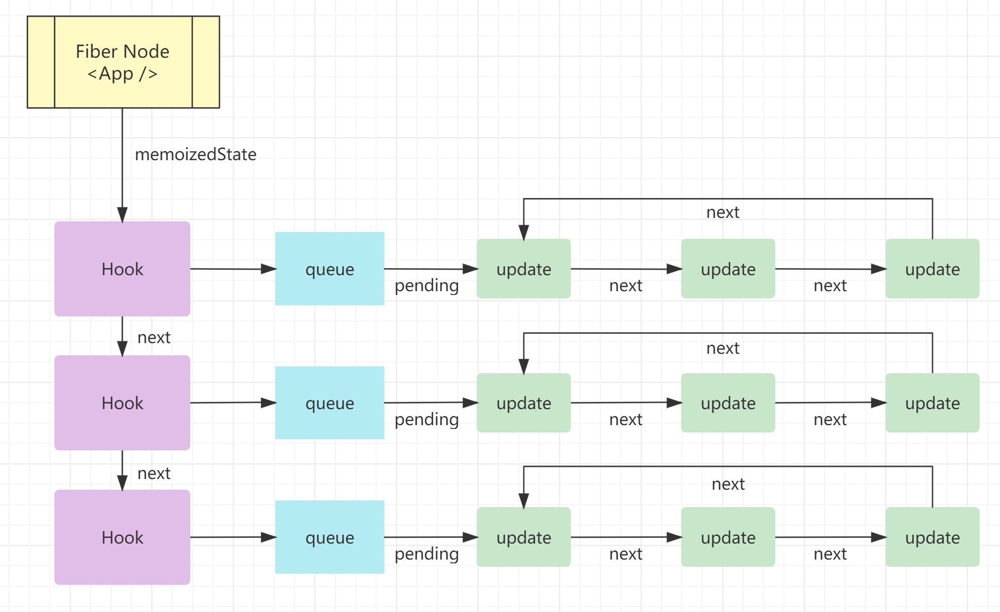
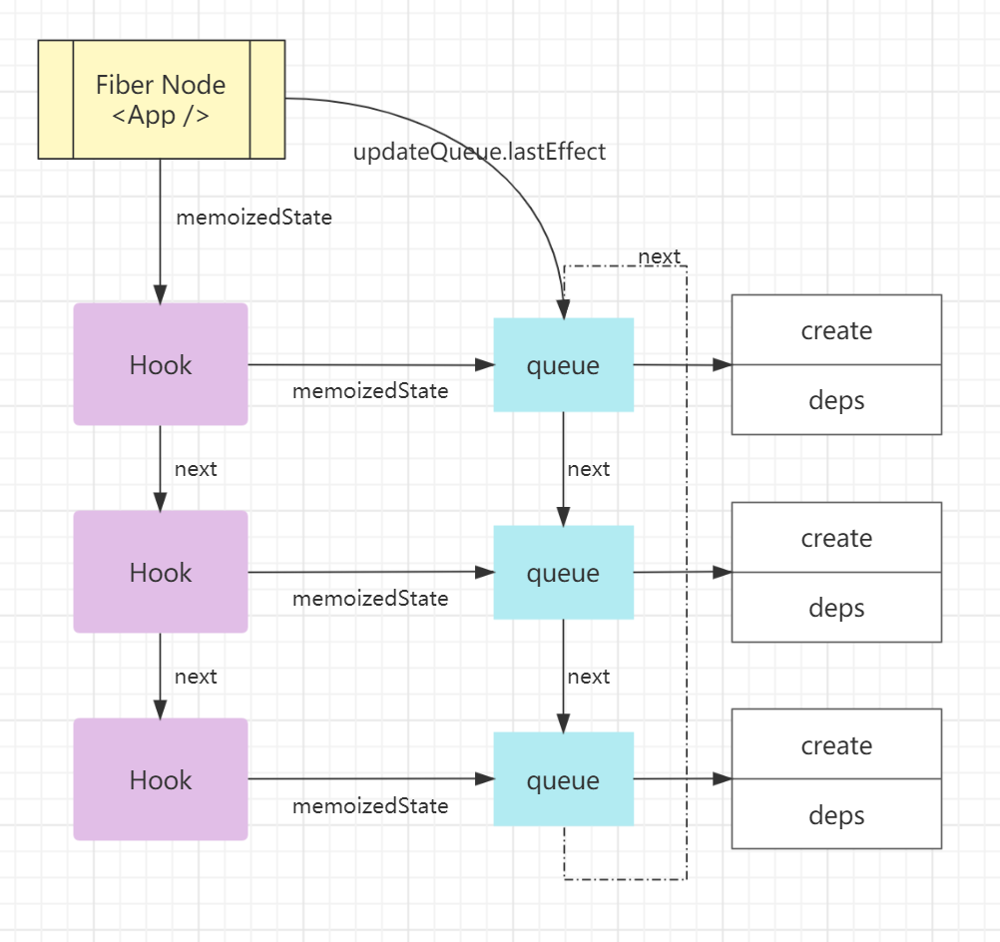

# hooks

Hooks 主要是利用闭包来保存状态，使用链表保存一系列 Hooks，将链表中的第一个 Hook 与 Fiber 关联。在 Fiber 树更新时，就能从 Hooks 中计算出最终输出的状态和执行相关的副作用。

[为什么用链表](https://overreacted.io/why-do-hooks-rely-on-call-order/)

## 定义

```js
export type Hook = {
  memoizedState: any, // 最新的状态值
  baseState: any, // 初始状态值
  baseQueue: Update<any, any> | null,
  queue: UpdateQueue<any, any> | null, // 环形链表，存储的是该 hook 多次调用产生的更新对象
  next: Hook | null, // next 指针，之下链表中的下一个 Hook
}

export type Fiber = {
  updateQueue: mixed, // 存储 Fiber 节点相关的副作用链表
  memoizedState: any, // 存储 Fiber 节点相关的状态值
  flags: Flags, // 标识当前 Fiber 节点是否有副作用
}
```
Hook数据结构中和fiber数据结构中都有memoizedState字段，但是表达的意义不同，Hook中是作为缓存的state值，但是fiber中是指向的当前fiber下的hooks队列的首个hook（hook是链表结构，指向首个，就意味着可以访问整个hooks队列）

## Hooks 如何与 Fiber 共同工作

Hooks 是一个单链表的结构，React 按 Hooks 的执行顺序依次将 Hook 节点添加到链表中

在每个状态 Hook（如 useState）节点中，会通过 queue 属性上的循环链表记住所有的更新操作，并在 update 阶段依次执行循环链表中的所有更新操作，最终拿到最新的 state 返回。



在每个副作用 Hook（如 useEffect）节点中，创建 effect 挂载到 Hook 的 memoizedState 中，并添加到环形链表的末尾，该链表会保存到 Fiber 节点的 updateQueue 中，在 commit 阶段执行。

副作用 Hooks 组成的链表的具体结构如下图所示



## 模拟实现

- 初次渲染的时候，按照 useState，useEffect 的顺序，把 state，deps 等按顺序塞到 hooks 数组中
- 更新的时候，按照顺序，从 memoizedState 中把上次记录的值拿出来。

```js
import React from 'react'
import ReactDOM from 'react-dom'

// 存放 hooks 的数组
let memoizedState
// 当前 memoizedState 下标
let cursor = 0
function useState(initialValue) {
  // 如果没有 state，说明是第一次执行，把 initialValue 复制给它
  memoizedState[cursor] = memoizedState[cursor] || initialValue
  // cursor 是全局可变的，所以需要保存本次的
  const currentCursor = cursor
  function setState(newState) {
    memoizedState[currentCursor] = newState
    // 重新渲染
    render()
  }
  // 返回当前 state，并 cursor + 1，使 state 可以继续存储
  return [memoizedState[cursor++], setState]
}
function useEffect(callback, depArray) {
  const hasNoDeps = !depArray
  const deps = memoizedState[cursor]
  const hasChangedDeps = deps ? !depArray.every((el, i) => el === deps[i]) : true
  if (hasNoDeps || hasChangedDeps) {
    callback()
    // 更新依赖值
    memoizedState[cursor] = depArray
  }
  // 更新下标，得以复用
  cursor++
}

function App() {
  const [count, setCount] = useState(0)
  const [username, setUsername] = useState('zjc')

  useEffect(() => {
    console.log(count)
  }, [count])
  useEffect(() => {
    console.log(username)
  }, [username])

  return (
    <div>
      <div>{count}</div>
      <button
        onClick={() => {
          setCount(count + 1)
        }}
      >
        click
      </button>
      <div>{username}</div>
      <button
        onClick={() => {
          setUsername(username + ' hello')
        }}
      >
        click
      </button>
    </div>
  )
}

function render() {
  // 在 rerender 的时候才能按照 hooks 在组件函数内的书写顺序从0依次获取 memoizedState 中的值
  cursor = 0
  ReactDOM.render(<App />, document.getElementById('root'))
}
render()
```

## 最新 state 问题

```js
import React, { useState } from 'react'
import ReactDOM from 'react-dom'

function App() {
  const [count, setCount] = useState(0)

  const handleAlertClick = () => {
    setTimeout(() => {
      alert('You clicked on: ' + count)
    }, 3000)
  }

  return (
    <div>
      <p>You clicked {count} times</p>
      <button onClick={() => setCount(count + 1)}>add</button>
      <button onClick={handleAlertClick}>show</button>
    </div>
  )
}

ReactDOM.render(<App />, document.getElementById('root'))
```
操作add，接着操作show，再定时器回调前继续add，就发现count不是最新的了。 其实在此例子前面的任意复用的 useState 和 useEffect的模式下，我们可以看出来，useEffect 实际每次都执行了，它相当于给我们存了一个快照，每次都有自己固定不变的state及状态。