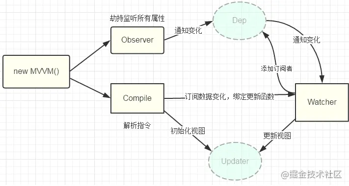

# initState

在 `src/core/instance/state.js` 初始化数据相关

- initState 函数是很多选项初始化的汇总，在 initState 函数内部使用 initProps 函数初始化 props 属性；
- 使用 initMethods 函数初始化 methods 属性；
- 使用 initData 函数初始化 data 选项；
- 使用 initComputed 函数和 initWatch 函数初始化 computed 和 watch 选项。

## initData

- 根据 vm.$options.data 选项获取真正想要的数据（注意：此时 vm.$options.data 是函数）
- 校验得到的数据是否是一个纯对象
- 检查数据对象 data 上的键是否与 props 对象上的键冲突 （**props 优先级 > data 优先级 > methods > computed优先级。**）
- 检查 methods 对象上的键是否与 data 对象上的键冲突
- 在 Vue 实例对象上添加代理访问数据对象的同名属性
- **最后调用 `observe` 函数开启响应式之路**

## 简易实现 响应式

```js
const data = {
  a: {
    b: 1,
  },
};
function walk(data) {
  for (let key in data) {
    const dep = [];
    let val = data[key];
    // 如果 val 是对象，递归调用 walk 函数将其转为访问器属性
    const nativeString = Object.prototype.toString.call(val);
    if (nativeString === '[object Object]') {
      walk(val);
    }
    Object.defineProperty(data, key, {
      set(newVal) {
        if (newVal === val) return;
        val = newVal;
        dep.forEach(fn => fn());
      },
      get() {
        dep.push(Target);
        return val;
      },
    });
  }
}

walk(data);

function $watch(exp, fn) {
  Target = fn;
  let pathArr,
    obj = data;
  // 如果 exp 是函数，直接执行该函数
  if (typeof exp === 'function') {
    exp();
    return;
  }
  if (/\./.test(exp)) {
    pathArr = exp.split('.');
    pathArr.forEach(p => {
      obj = obj[p];
    });
    return;
  }
  data[exp];
}

$watch('a.b', () => {
  console.log('修改了字段 a.b');
});
```
## 原理
所以响应式原理就是，我们通过递归遍历，把vue实例中data里面定义的数据，用defineReactive（Object.defineProperty）重新定义。每个数据内新建一个Dep实例，闭包中包含了这个 Dep 类的实例，用来收集 Watcher 对象。在对象被「读」的时候，会触发 reactiveGetter 函数把当前的 Watcher 对象（存放在 Dep.target 中）收集到 Dep 类中去。之后如果当该对象被「写」的时候，则会触发 reactiveSetter 方法，通知 Dep 类调用 notify 来触发所有 Watcher 对象的 update 方法更新对应视图。
## 实现逻辑

- observe 处理 data 里定义的数据，使之变成响应式（这里对象数据和数组数据稍有不同）

- `Object.defineProperty` 劫持数据。在 getter 中 收集依赖，在 setter 中触发更新。

- Dep 实例，用来存储依赖。每一个数据字段都通过闭包引用着属于自己的 dep 常量。Dep 有一个静态属性 target，这是一个全局唯一 Watcher，这是一个非常巧妙的设计，因为在同一时间只能有一个全局的 Watcher 被计算，另外它的自身属性 subs 也是 Watcher 的数组。（）

- 为使用到数据的模板，创建一个 `Watcher`实例(在挂载过程中 `mountComponent`)。在这个过程中会通过 getter 获取数据，触发相应式收集依赖。

- 谁用到了数据，谁就是依赖，我们就为谁创建一个 Watcher 实例。在之后数据变化时，我们不直接去通知依赖更新，而是通知依赖对应的 Watch 实例，由 Watcher 实例去通知真正的视图。

### 数组和对象的不同

当被读取的数据对象的属性值是数组时，会调用 dependArray 函数，该函数将通过 for 循环遍历数组，并取得数组每一个元素的值，如果该元素的值拥有 `__ob__` 对象和 `__ob__.dep` 对象，那说明该元素也是一个对象或数组，此时只需要手动执行 `__ob__.dep.depend()` 即可达到收集依赖的目的。同时如果发现数组的元素仍然是一个数组，那么需要递归调用 dependArray 继续收集依赖

```js
// 收集依赖也是在 getter 中。
// defineReactive 函数， src/core/observer/index.js
let childOb = !shallow && observe(val)
  Object.defineProperty(obj, key, {
    enumerable: true,
    configurable: true,
    get: function reactiveGetter () {
      const value = getter ? getter.call(obj) : val
      if (Dep.target) {
        dep.depend()
        if (childOb) {
          childOb.dep.depend()
          if (Array.isArray(value)) {
            dependArray(value)
          }
        }
      }
      return value
    },
    set:()=>{}
  }


function dependArray (value: Array<any>) {
  for (let e, i = 0, l = value.length; i < l; i++) {
    e = value[i]
    e && e.__ob__ && e.__ob__.dep.depend()
    if (Array.isArray(e)) {
      dependArray(e)
    }
  }
}
```

因为**数组的索引是非响应式的**，响应式过程中，数组和对象稍有不同，数组是通过 重写了 7 个 方法，来达成劫持数据，通知依赖更新的过程。


```js
// 源码位置：/src/core/observer/array.js

const arrayProto = Array.prototype;
// 创建一个对象作为拦截器
export const arrayMethods = Object.create(arrayProto);

// 改变数组自身内容的7个方法
const methodsToPatch = ['push', 'pop', 'shift', 'unshift', 'splice', 'sort', 'reverse'];
/**
 * Intercept mutating methods and emit events
 */
methodsToPatch.forEach(function (method) {
  const original = arrayProto[method]; // 缓存原生方法
  Object.defineProperty(arrayMethods, method, {
    enumerable: false,
    configurable: true,
    writable: true,
    value: function mutator(...args) {
      const result = original.apply(this, args);
      const ob = this.__ob__;
      // notify change
      ob.dep.notify();
      return result;
    },
  });
});
```

- 首先创建了继承自 Array 原型的空对象 arrayMethods
- 接着在 arrayMethods 上使用 object.defineProperty 方法将那些可以改变数组自身的 7 个方法遍历逐个进行封装
- 当我们使用 push 方法的时候，其实用的是 arrayMethods.push，而 arrayMethods.push 就是封装的新函数 mutator
- original 函数就是 Array.prototype 上对应的原生方法。 那么，接下来我们就可以在 mutator 函数中做一些其他的事，比如说发送变化通知

# 一些问题

## 深度侦测

```js
export class Observer {
  value: any;
  dep: Dep;

  constructor(value: any) {
    this.value = value;
    this.dep = new Dep();
    def(value, '__ob__', this);
    if (Array.isArray(value)) {
      const augment = hasProto ? protoAugment : copyAugment;
      augment(value, arrayMethods, arrayKeys);
      this.observeArray(value); // 将数组中的所有元素都转化为可被侦测的响应式
    } else {
      this.walk(value);
    }
  }

  /**
   * Observe a list of Array items.
   */
  observeArray(items: Array<any>) {
    for (let i = 0, l = items.length; i < l; i++) {
      observe(items[i]);
    }
  }
}

export function observe(value, asRootData) {
  if (!isObject(value) || value instanceof VNode) {
    return;
  }
  let ob;
  if (hasOwn(value, '__ob__') && value.__ob__ instanceof Observer) {
    ob = value.__ob__;
  } else {
    ob = new Observer(value);
  }
  return ob;
}
```

- 对于 Array 型数据，调用了 observeArray()方法，该方法内部会遍历数组中的每一个元素，然后通过调用 observe 函数将每一个元素都转化成可侦测的响应式数据
- 对应 object 数据，在 defineReactive 函数中进行了递归操作

## 数组新增元素的侦测

和改变数据元素原理类似，数组新增元素，主要是通过 三个方法来实现。`push,unshift,splice`

```js
/**
 * Intercept mutating methods and emit events
 */
methodsToPatch.forEach(function (method) {
  // cache original method
  const original = arrayProto[method];
  def(arrayMethods, method, function mutator(...args) {
    const result = original.apply(this, args);
    const ob = this.__ob__;
    let inserted;
    switch (method) {
      case 'push':
      case 'unshift':
        inserted = args; // 如果是push或unshift方法，那么传入参数就是新增的元素
        break;
      case 'splice':
        inserted = args.slice(2); // 如果是splice方法，那么传入参数列表中下标为2的就是新增的元素
        break;
    }
    if (inserted) ob.observeArray(inserted); // 调用observe函数将新增的元素转化成响应式
    // notify change
    ob.dep.notify();
    return result;
  });
});
```

## 重复订阅

在添加 deps 的订阅过程，能通过 id 去重避免重复订阅

- 让 dep 和 watcer 彼此记住，然后相同则不存入
- Dep 收集时不直接 push，而是调用将存入的 watcher 的记录 Dep 的方法，此方法除使得 watcher 记录 dep 外还会默认将 dep 存储 watcher

```js
//  watcher.js
depend(){
  if(Dep.target){
    Dep.target.addDep(this);
  }
}
// watcher.js
addDep(dep){
  let id = dep.id;
  if(!this.depsId.has(id)){
      this.deps.push(dep);
      this.depsId.add(id);
      dep.addSub(this);
  }
}

```

## 依赖清空

```js
cleanupDeps () {
  let i = this.deps.length
  while (i--) {
    const dep = this.deps[i]
    if (!this.newDepIds.has(dep.id)) {
      dep.removeSub(this)
    }
  }
  let tmp = this.depIds
  this.depIds = this.newDepIds
  this.newDepIds = tmp
  this.newDepIds.clear()
  tmp = this.deps
  this.deps = this.newDeps
  this.newDeps = tmp
  this.newDeps.length = 0
}
```

Vue 是数据驱动的，所以每次数据变化都会重新 render，那么 vm.\_render() 方法又会再次执行，并再次触发数据的 getters，所以 Watcher 在构造函数中会初始化 2 个 Dep 实例数组，newDeps 表示新添加的 Dep 实例数组，而 deps 表示上一次添加的 Dep 实例数组。

我们的模板会根据 v-if 去渲染不同子模板 a 和 b，当我们满足某种条件的时候渲染 a 的时候，会访问到 a 中的数据，这时候我们对 a 使用的数据添加了 getter，做了依赖收集，那么当我们去修改 a 的数据的时候，理应通知到这些订阅者。那么如果我们一旦改变了条件渲染了 b 模板，又会对 b 使用的数据添加了 getter，如果我们没有依赖移除的过程，那么这时候我去修改 a 模板的数据，会通知 a 数据的订阅的回调，这显然是有浪费的。

Vue 设计了在每次添加完新的订阅，会移除掉旧的订阅，这样就保证了在我们刚才的场景中，如果渲染 b 模板的时候去修改 a 模板的数据，a 数据订阅回调已经被移除了，所以不会有任何浪费.

## Vue.set($set) 和 Vue.delete($delete)

Vue 是没有能力拦截到为一个对象(或数组)添加属性(或元素)的，而 Vue.set 和 Vue.delete 就是为了解决这个问题而诞生的

```js
/**
 * Set a property on an object. Adds the new property and
 * triggers change notification if the property doesn't
 * already exist.
 */
// 第一个参数 target 是将要被添加属性的对象，第二个参数 key 以及第三个参数 val 分别是要添加属性的键名和值。
export function set(target: Array<any> | Object, key: any, val: any): any {
  // 如果 set 函数的第一个参数是 undefined 或 null 或者是原始类型值，那么在非生产环境下会打印警告信息
  if (process.env.NODE_ENV !== 'production' && (isUndef(target) || isPrimitive(target))) {
    warn(`Cannot set reactive property on undefined, null, or primitive value: ${(target: any)}`);
  }
  // 如果 target 是一个数组，并且 key 是一个有效的数组索引
  // 直接修改 arr[0] 的值是不能够触发响应的，但是如果我们使用 $set 函数重新设置 arr 数组索引为 0 的元素的值，这样是能够触发响应的
  // 使用数组的 splice 变异方法能够完成数组元素的删除、添加、替换等操作
  if (Array.isArray(target) && isValidArrayIndex(key)) {
    // 将数组的长度修改为 target.length 和 key 中的较大者，否则如果当要设置的元素的索引大于数组长度时 splice 无效
    target.length = Math.max(target.length, key);
    target.splice(key, 1, val);
    return val;
  }
  // 当给一个纯对象设置属性的时候，假设该属性已经在对象上有定义了，那么只需要直接设置该属性的值即可，这将自动触发响应，因为已存在的属性是响应式的
  if (key in target && !(key in Object.prototype)) {
    target[key] = val;
    return val;
  }
  // 此时正在给对象添加一个全新的属性
  // 定义了 ob 常量，它是数据对象 __ob__ 属性的引用
  const ob = (target: any).__ob__;
  // 第一个条件成立时，那么说明你正在使用 Vue.set/$set 函数为 Vue 实例对象添加属性（不被允许，为了避免属性覆盖的情况出现）

  // 第二个条件是：根数据对象将拥有一个特质，即 target.__ob__.vmCount > 0，这样条件 (ob && ob.vmCount) 是成立的，也就是说：当使用 Vue.set/$set 函数为根数据对象添加属性时，是不被允许的。
  // 永远触发不了依赖,因为 根数据对象的 Observer 实例收集不到依赖，data本身并不是响应的
  if (target._isVue || (ob && ob.vmCount)) {
    process.env.NODE_ENV !== 'production' &&
      warn('Avoid adding reactive properties to a Vue instance or its root $data ' + 'at runtime - declare it upfront in the data option.');
    return val;
  }
  if (!ob) {
    target[key] = val;
    return val;
  }
  //  defineReactive 函数设置属性值，这是为了保证新添加的属性是响应式的
  defineReactive(ob.value, key, val);
  // 调用了 __ob__.dep.notify() 从而触发响应
  ob.dep.notify();
  return val;
}
```


