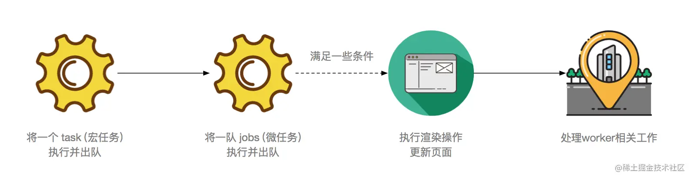

## Vue 异步更新

`Vue`通知视图更新，是通过`dep.notify`.

```js
// dep.js
notify () {
  const subs = this.subs.slice();
  // 循环通知所有watcher更新
  for (let i = 0, l = subs.length; i < l; i++) {
      subs[i].update()
  }
}
```

首先循环通知所有 watcher 更新，我们发现 watcher 执行了 update 方法。

```js
// watcher.js
update () {
  if (this.lazy) {
      // 如果是计算属性
      this.dirty = true
  } else if (this.sync) {
      // 如果要同步更新
      this.run()
  } else {
      // 进入更新队列
      queueWatcher(this)
  }
}

```

update 方法首先判断是不是计算属性或开发者定义了同步更新，接着进入异步队列方法 queueWatcher

```js
export function queueWatcher(watcher: Watcher) {
  // 获取watcherid
  const id = watcher.id;
  if (has[id] == null) {
    // 保证只有一个watcher，避免重复
    has[id] = true;

    // 推入等待执行的队列
    queue.push(watcher);

    // ...省略细节代码
  }
  // 将所有更新动作放入nextTick中，推入到异步队列
  nextTick(flushSchedulerQueue);
}

function flushSchedulerQueue() {
  for (index = 0; index < queue.length; index++) {
    watcher = queue[index];
    watcher.run();
    // ...省略细节代码
  }
}
```

通过上述代码可以看出我们将所有要更新的 watcher 队列放入了 nextTick 中。 nextTick 的官方解读为:

> 在下次 DOM 更新循环结束之后执行延迟回调。在修改数据之后立即使用这个方法，获取更新后的 DOM

> 这里的描述其实限制了 nextTick 的技能，实际上 nextTick 就是一个异步方法，也许和你使用的 setTimeout 没有太大的区别。

## nextTick

`nextTick` 的定义位于源码的 `src/core/util/next-tick.js`中，其大概可分为两大部分：

- 能力检测 `Promise > MutationObserver > setImmediate > setTimeout`
- 根据能力检测以不同方式执行回调队列

```js

const callbacks = []; // 回调队列
let pending = false; // 异步锁

// 执行队列中的每一个回调
function flushCallbacks() {
  pending = false; // 重置异步锁
  // 防止出现nextTick中包含nextTick时出现问题，在执行回调函数队列前，提前复制备份并清空回调函数队列
  const copies = callbacks.slice(0);
  callbacks.length = 0;
  // 执行回调函数队列
  for (let i = 0; i < copies.length; i++) {
    copies[i]();
  }
}
let timerFunc

if (typeof Promise !== 'undefined' && isNative(Promise)) {
  const p = Promise.resolve()
  timerFunc = () => {
      p.then(flushCallbacks)
  }
  isUsingMicroTask = true
} else if (!isIE && typeof MutationObserver !== 'undefined' && (
    // 当原生 Promise 不可用时，timerFunc 使用原生 MutationObserver
    // MutationObserver不要在意它的功能，其实就是个可以达到微任务效果的备胎
)) {
  timerFunc = () => {
      // 使用 MutationObserver
  }
  isUsingMicroTask = true

} else if (typeof setImmediate !== 'undefined' &&  isNative(setImmediate)) {
  // 如果原生 setImmediate 可用，timerFunc 使用原生 setImmediate
  timerFunc = () => {
    setImmediate(flushCallbacks)
  }
} else {
  // 最后的倔强，timerFunc 使用 setTimeout
  timerFunc = () => {
    setTimeout(flushCallbacks, 0)
  }
}

```

## 执行回调队列

```js
export function nextTick(cb?: Function, ctx?: Object) {
  let _resolve;
  // 将回调函数推入回调队列
  callbacks.push(() => {
    if (cb) {
      try {
        cb.call(ctx);
      } catch (e) {
        handleError(e, ctx, 'nextTick');
      }
    } else if (_resolve) {
      _resolve(ctx);
    }
  });
  if (!pending) {
    pending = true;
    timerFunc();
  }
  // 这是当 nextTick 不传 cb 参数的时候，提供一个 Promise 化的调用，比如：
  // nextTick().then(() => {})
  if (!cb && typeof Promise !== 'undefined') {
    return new Promise(resolve => {
      _resolve = resolve;
    });
  }
}
```

nextTick 函数:

- 先把传入的回调函数 cb 推入 回调队列 callbacks 数组，同时在接收第一个回调函数时，执行能力检测中对应的异步方法（异步方法中调用了回调函数队列）。
- 执行异步延迟函数 timerFunc

## 版本差异

其实 Vue 2.4、2.5、2.6 版本的 nextTick 策略都不一样。

整体 2.6 和 2.4 的比较相似。（仔细瞅了瞅，基本就是一样的，2.6 的 timerFunc 多了个 setImmediate 判断）

2.5 版本其实也差不多，源码写法有些不一样，整体优先级是：Promise > setImmediate > MessageChannel > setTimeout，如果更新是在 v-on 事件处理程序中触发的，nextTick 会采用 macrotask。感兴趣可自行去末尾的参考地址进行查阅。

[https://github.com/vuejs/vue/blob/v2.6.7/src/core/util/next-tick.js](https://github.com/vuejs/vue/blob/v2.6.7/src/core/util/next-tick.js)

[https://github.com/vuejs/vue/blob/v2.5.22/src/core/util/next-tick.js](https://github.com/vuejs/vue/blob/v2.5.22/src/core/util/next-tick.js)

[https://github.com/vuejs/vue/blob/v2.4.4/src/core/util/env.js](https://github.com/vuejs/vue/blob/v2.4.4/src/core/util/env.js)

## nextTick 为什么要尽可能的 microtask 优先？



我们发现，原来在执行微任务之后还会执行渲染操作！！！（当然并不是每次都会，但至少顺序我们是可以肯定的）。

- 在一轮 event loop 中多次修改同一 dom，只有最后一次会进行绘制。
- 渲染更新`（Update the rendering）`会在 `event loop` 中的 `tasks` 和 `microtasks` 完成后进行，但并不是每轮 `event loop` 都会更新渲染，这取决于是否修改了 dom 和浏览器觉得是否有必要在此时立即将新状态呈现给用户。如果在一帧的时间内（时间并不确定，因为浏览器每秒的帧数总在波动，16.7ms 只是估算并不准确）修改了多处 dom，浏览器可能将变动积攒起来，只进行一次绘制，这是合理的。
- 如果希望在每轮 event loop 都即时呈现变动，可以使用 requestAnimationFrame。


假设现在执行到某个 task，我们对批量的 dom 进行异步修改，我们将此任务插进 tasks，也就是用宏任务实现。


显而易见，这种情况下如果 task 里排队的队列比较多，同时遇到多次的微任务队列执行完。那很有可能触发多次浏览器渲染，但是依旧没有执行我们真正的修改 dom 任务

这种情况，不仅会延迟视图更新，带来性能问题。还有可能导致视图上一些诡异的问题。 因此，此任务插进 microtasks：


可以看到如果 task 队列如果有大量的任务等待执行时，将 dom 的变动作为 microtasks 而不是宏任务（task）能更快的将变化呈现给用户。


## 从 event loop 规范探究 javaScript 异步及浏览器更新渲染时机

[从 event loop 规范探究 javaScript 异步及浏览器更新渲染时机 ](https://github.com/aooy/blog/issues/5)
