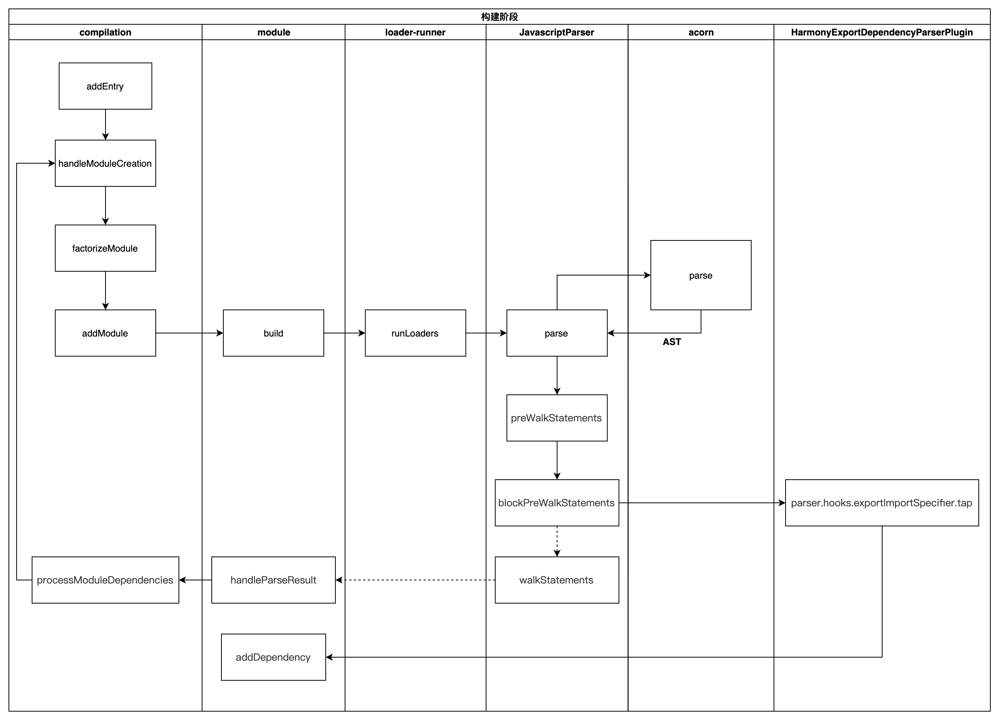

使用 webpack 的一个最主要原因是为了简化页面依赖的管理，并且通过将其打包为一个文件来降低页面加载时请求的资源
数。

我认为 webpack 的主要原理是，它将所有的资源都看成是一个模块，并且把页面逻辑当作一个整体，通过一个给定的入口文件，webpack 从这个文件开始，找到所有的依赖文件，将各个依赖文件模块通过 loader 和 plugins 处理后，然后打包在一起，最后输出一个浏览器可识别的 JS 文件。

- Webpack 具有四个核心的概念，分别是 Entry（入口）、Output（输出）、loader 和 Plugins（插件）。

- Entry 是 webpack 的入口起点，它指示 webpack 应该从哪个模块开始着手，来作为其构建内部依赖图的开始。

- Output 属性告诉 webpack 在哪里输出它所创建的打包文件，也可指定打包文件的名称，默认位置为 ./dist。

- loader 可以理解为 webpack 的编译器，它使得 webpack 可以处理一些非 JavaScript 文件。在对 loader 进行配置的时候，test 属性，标志有哪些后缀的文件应该被处理，是一个正则表达式。use 属性，指定 test 类型的文件应该使用哪个 loader 进行预处理。常用的 loader 有 css-loader、style-loader 等。

- 插件可以用于执行范围更广的任务，包括打包、优化、压缩、搭建服务器等等，要使用一个插件，一般是先使用 npm 包管理器进行安装，然后在配置文件中引入，最后将其实例化后传递给 plugins 数组属性。

使用 webpack 的确能够提供我们对于项目的管理，但是它的缺点就是调试和配置起来太麻烦了。但现在 webpack4.0 的免配置一定程度上解决了这个问题。但是我感觉就是对我来说，就是一个黑盒，很多时候出现了问题，没有办法很好的定位。

webpack 构建的核心任务是完成内容转化和资源合并。主要包含以下 3 个阶段：

- 初始化阶段
  - 初始化参数：从配置文件、配置对象和 Shell 参数中读取并与默认参数进行合并，组合成最终使用的参数。
  - 创建编译对象：用上一步得到的参数创建 Compiler 对象。
  - 初始化编译环境：包括注入内置插件、注册各种模块工厂、初始化 RuleSet 集合、加载配置的插件等。

- 构建阶段
  - 开始编译：执行 Compiler 对象的 run 方法，创建 Compilation 对象。
  - 确认编译入口：进入 entryOption 阶段，读取配置的 Entries，递归遍历所有的入口文件，调用 Compilation.addEntry 将入口文件转换为 Dependency 对象。
  - 编译模块（make）： 调用 normalModule 中的 build 开启构建，从 entry 文件开始，调用 loader 对模块进行转译处理，然后调用 JS 解释器（acorn）将内容转化为 AST 对象，然后递归分析依赖，依次处理全部文件。
  - 完成模块编译：在上一步处理好所有模块后，得到模块编译产物和依赖关系图。
    

  

- 生成阶段
  - 输出资源（seal）：根据入口和模块之间的依赖关系，组装成多个包含多个模块的 Chunk，再把每个 Chunk 转换成一个 Asset 加入到输出列表，这步是可以修改输出内容的最后机会。
  - 写入文件系统（emitAssets）：确定好输出内容后，根据配置的 output 将内容写入文件系统。