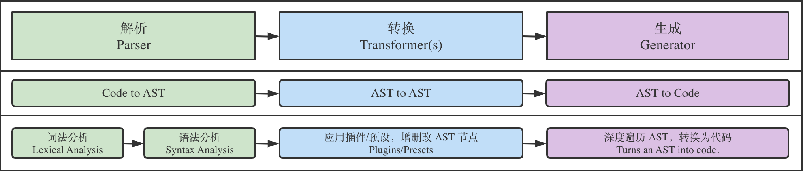

# babel

Babel 是 JavaScript 编译器：他能让开发者在开发过程中，直接使用各类方言（如 TS、Flow、JSX）或新的语法特性，而不需要考虑运行环境，因为 Babel 可以做到按需转换为低版本支持的代码；Babel 内部原理是将 JS 代码转换为 AST，对 AST 应用各种插件进行处理，最终输出编译后的 JS 代码。

## AST 抽象语法树

以树的形式来表现编程语言的语法结构, 类似虚拟dom。定义很多字段来描述当前代码。

AST 是源代码的高效表示，能便捷的表示大多数编程语言的结构。适用于做代码分析或转换等需求。之所以用树来进行分析或转换，是因为树能使得程序中的每一节点恰好被访问一次（前序或后序遍历）。

常见使用场景：代码压缩混淆功能可以借助 AST 来实现：分析 AST，基于各种规则进行优化（如 IF 语句优化；移除不可访问代码；移除 debugger 等），从而生成更小的 AST 树，最终输出精简的代码结果。

## Babel 编译流程

- 解析阶段：Babel 默认使用 @babel/parser 将代码转换为 AST。解析一般分为两个阶段：词法分析和语法分析
  - 词法分析：对输入的字符序列做标记化(tokenization)操作
  - 语法分析：处理标记与标记之间的关系，最终形成一颗完整的 AST 结构。

- 转换阶段：Babel 使用 @babel/traverse 提供的方法对 AST 进行深度优先遍历，调用插件对关注节点的处理函数，按需对 AST 节点进行增删改操作。

- 生成阶段：Babel 默认使用 @babel/generator 将上一阶段处理后的 AST 转换为代码字符串。