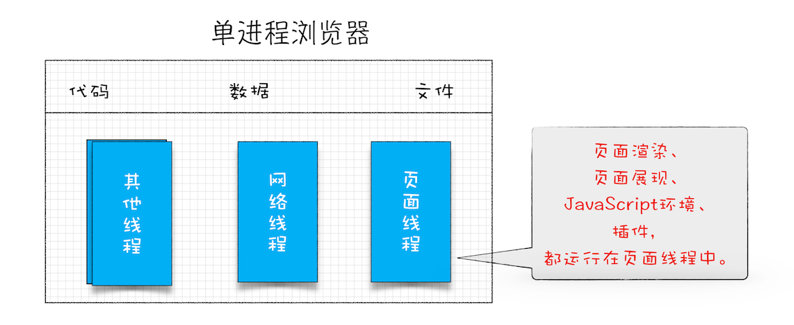

## 线程 VS 进程

一个进程就是一个程序的运行实例。详细解释就是，启动一个程序的时候，操作系统会为该程序创建一块内存，用来存放代码、运行中的数据和一个执行任务的主线程，我们把这样的一个运行环境叫进程。

线程是依附于进程的，而进程中使用多线程并行处理能提升运算效率。

1. 进程中的任意一线程执行出错，都会导致整个进程的崩溃。
2. 线程之间共享进程中的数据。
3. 当一个进程关闭之后，操作系统会回收进程所占用的内存。
4. 进程之间的内容相互隔离。

## 早期单进程浏览器时代
单进程浏览器是指浏览器的所有功能模块都是运行在同一个进程里，这些模块包含了网络、插件、JavaScript 运行环境、渲染引擎和页面等

1. 不稳定
2. 不流畅
3. 不安全

## 目前多进程浏览器时代
Chrome 的页面是运行在单独的渲染进程中的，同时页面里的插件也是运行在单独的插件进程之中，而进程之间是通过 IPC 机制进行通信（如图中虚线部分）

从图中可以看出，最新的 Chrome 浏览器包括：1 个浏览器（Browser）主进程、1 个 GPU 进程、1 个网络（NetWork）进程、多个渲染进程和多个插件进程。

+ **浏览器进程** 主要负责界面显示、用户交互、子进程管理，同时提供存储功能。
+ **渲染进程** 核心任务是将HTML、CSS和JS转化为用户可以操作的页面，排版引擎Blink和js引擎V8都是运行在该进程中，默认情况下，chrome会为每一个tab标签创建一个渲染进程。处于安全考虑，渲染进程都是运行在沙箱模式下。
+ **GPU进程** 其实chrome刚发布的时候是没有GPU进程的，GPU的使用初衷是实现3D CSS的效果，只是随后网页、Chrome 的 UI 界面都选择采用 GPU 来绘制，这使得 GPU 成为浏览器普遍的需求。最后，Chrome 在其多进程架构上也引入了 GPU 进程。
+ **网络进程** 主要负责页面的网络资源加载。之前是作为一个模块运行在浏览器进程里的，直至最近才独立出来，成为一个单独的进程。
+ **插件进程** 主要是负责插件的运行，因插件容易奔溃，所以需要插件进程来保护，以保证插件进程奔溃不会对浏览器和页面造成影响。

所以 ，打开 1 个页面至少需要 1 个网络进程、1 个浏览器进程、1 个 GPU 进程以及 1 个渲染进程，共 4 个；如果打开的页面有运行插件的话，还需要再加上 1 个插件进程。

## 未来面向服务的架构
多线程浏览器架构也有一些问题
+ **更高的资源占用**。因为每个进程都会包含公共基础结构的副本（如 JavaScript 运行环境），这就意味着浏览器会消耗更多的内存资源。
+ **更复杂的体系架构**。浏览器各模块之间耦合性高、扩展性差等问题，会导致现在的架构已经很难适应新的需求了。

在 2016 年，Chrome 官方团队使用“面向服务的架构”（Services Oriented Architecture，简称SOA）的思想设计了新的 Chrome 架构。也就是说 Chrome 整体架构会朝向现代操作系统所采用的“面向服务的架构” 方向发展，原来的各种模块会被重构成独立的服务（Service），每个服务（Service）都可以在独立的进程中运行，访问服务（Service）必须使用定义好的接口，通过 IPC 来通信，从而构建一个更内聚、松耦合、易于维护和扩展的系统，更好实现 Chrome 简单、稳定、高速、安全的目标
