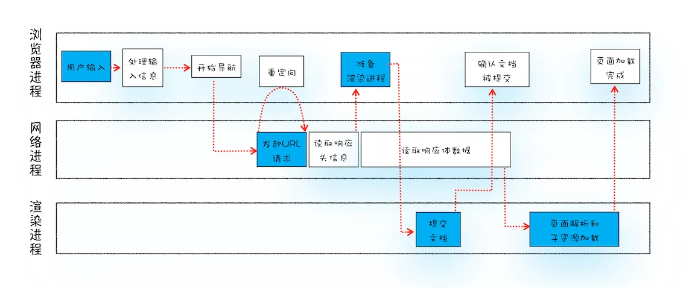

## 从输入URL到页面展示

用户发出 URL 请求到页面开始解析的这个过程，就叫做导航。
### 用户从浏览器进程里**输入请求信息**    
  用户在地址栏输入，地址栏会判断输入的关键字是**搜索内容**，还是**请求的URL**。
  + 如果是搜索内容，通过默认搜索引擎，合成带有关键字的url
  + 如果判断符合URL规则，那么地址栏会根据规则，把这段内容加上协议，合成为完整的 URL。

### 网络进程**发起URL请求**  
  页面资源请求过程。这时，浏览器进程会通过进程间通信（IPC）把 URL 请求发送至网络进程，网络进程接收到 URL 请求后，会在这里发起真正的 URL 请求流程。具体可看HTTP请求流程。等网络进程接收了服务器响应行和响应头之后，就开始解析响应头的内容  
  + 重定向。302
  + 根据`Content-Type`,处理响应数据。`Content-Type`在request header和response header里都存在。解析数据或者通过下载管理器下载。  
    + `application/octet-stream` （字节流，下载）
    + `application/x-www-form-urlencoded`
    + `application/json`
    + `text/xml`

### 服务器响应URL请求，浏览器进程开始**准备渲染进程**  
  + 同一站点：相同的协议和根域名
  + 打开一个新页面采用的渲染进程策略就是：  
    + 通常情况下，打开新的页面都会使用单独的渲染进程；  
    + 如果从 A 页面打开 B 页面，且 A 和 B 都属于同一站点的话，那么 B 页面复用 A 页面的渲染进程；如果是其他情况，浏览器进程则会为 B 创建一个新的渲染进程。 

### 渲染进程准备好之后，需要先向渲染进程提交页面的数据。就是**提交文档阶段**  
  + 浏览器进程发出“提交文档”消息，渲染进程收到消息，会和网络进程建立数据传输的管道
  + 文档传输完毕，渲染进程会返回**“确认提交”**的消息给浏览器进程
  + 浏览器进程收到”确认提交“消息，会**更新浏览器界面状态**，包括了安全状态、地址栏的 URL、前进后退的历史状态，并更新 Web 页面。  
  到这里，一个完整的导航流程就“走”完了，这之后就要进入渲染阶段了。

### 渲染进程接收完文档信息，开始**解析页面和加载子资源**，完成渲染
 见下篇`DOM`和`CSSDM`，一个他们合成的`Render Tree`