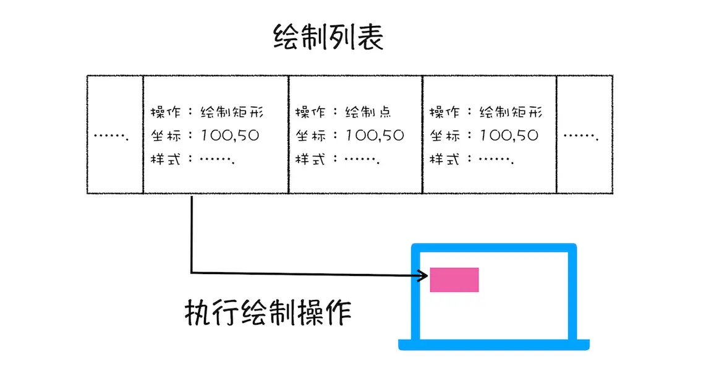
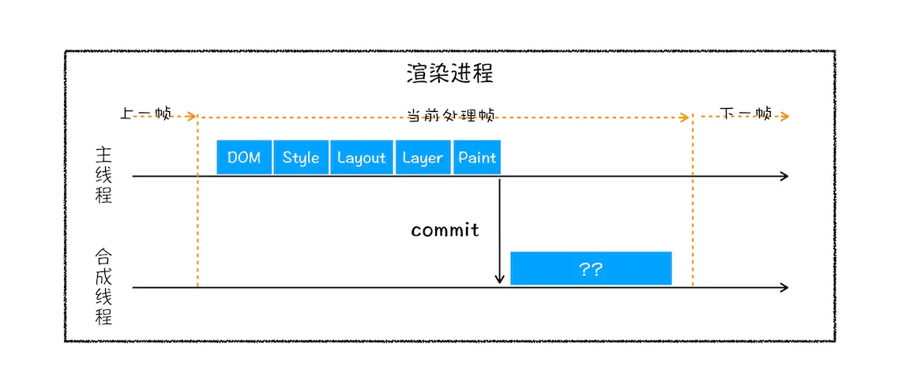

# 渲染页面  
按照渲染的使劲按顺序，可以分为构建DOM树、样式计算、布局阶段、分层、绘制、分块、光栅化和合成。

## 构建dom树   
将html转化为浏览器能够理解的结构**DOM树**    

## 样式计算（Recalculate Style）  
样式计算的目的是为了计算出 DOM 节点中每个元素的具体样式。  
  + 把css转化为浏览器能够理解的结构。和 HTML 文件一样，浏览器也是无法直接理解这些纯文本的 CSS 样式，所以当渲染引擎接收到 CSS 文本时，会执行一个转换操作，将 CSS 文本转换为浏览器可以理解的结构——styleSheets。styleSheets具备了查询和修改功能。`document.styleSheets` 
  +  转换样式表中的属性值，使其标准化
  +  计算出 DOM 树中每个节点的具体样式   
  涉及到 CSS 的继承规则和层叠规则。   
     + CSS 继承就是每个 DOM 节点都包含有父节点的样式
     + 样式层叠。层叠是 CSS 的一个基本特征，它是一个定义了如何合并来自多个源的属性值的算法。它在 CSS 处于核心地位，CSS 的全称“层叠样式表”正是强调了这一点。

## 布局阶段
有DOM树和DOM树中元素的样式，还不足以显示页面。还需要**计算出DOM树中可见元素的几何位置**。这个过程叫做布局。
+ **创建布局树（layoutTree）**： 一棵只包含可见元素布局树。  
  + 遍历 DOM 树中的所有可见节点，并把这些节点加到布局中；
  + 而不可见的节点会被布局树忽略掉，如 head 标签下面的全部内容，再比如 body.p.span 这个元素，因为它的属性包含 dispaly:none，所以这个元素也没有被包进布局树。
+ 布局计算    
有了布局树，就要计算布局树节点的坐标位置。  
在执行布局操作的时候，会把布局运算的结果重新写回布局树中，所以布局树既是输入内容也是输出内容，这是布局阶段一个不合理的地方.

## 分层
因为页面中有很多复杂的效果，如一些复杂的 3D 变换、页面滚动，或者使用 z-indexing 做 z 轴排序等，为了更加方便地实现这些效果，渲染引擎还需要为特定的节点生成专用的图层，并生成一棵对应的**图层树（LayerTree）**。  
通常情况下，**并不是布局树的每个节点都包含一个图层，如果一个节点没有对应的层，那么这个节点就从属于父节点的图层**。  
通常满足下面两点中任意一点的元素就可以被提升为单独的一个图层。  
+ 拥有层叠上下文属性的元素会被提升为单独的一层。（position：fixed、z-index、filter:blue、opacity）
+ 需要 **剪裁(clip)** 的地方也会被创建为图层。：（滚动条）

## 图层绘制
在完成图层树的构建之后，渲染引擎会对图层树中的每个图层进行绘制。渲染引擎实现图层的绘制，会把一个图层的绘制拆分成很多小的绘制指令，然后再把这些指令按照顺序组成一个待绘制列表

## 栅格化（raster）操作
绘制列表只是用来记录绘制顺序和绘制指令的列表，而实际上绘制操作是由渲染引擎中的合成线程来完成的。你可以结合下图来看下渲染主线程和合成线程之间的关系：  

当图层的绘制列表准备好之后，主线程会把该绘制列表提交（commit）给合成线程.

页面可视区域称为**视口(viewport)**，如果图层很大，通过视口只能看见一小部分。合成线程会将图层划分为**图块（tile）**

**然后合成线程会按照视口附近的图块来优先生成位图，实际生成位图的操作是由栅格化来执行的。所谓栅格化，是指将图块转换为位图**  

通常，栅格化过程都会使用 GPU 来加速生成，使用 GPU 生成位图的过程叫快速栅格化，或者 GPU 栅格化，生成的位图被保存在 GPU 内存中。GPU 操作是运行在 GPU 进程中，如果栅格化操作使用了 GPU，那么最终生成位图的操作是在 GPU 中完成的，这就涉及到了跨进程操作  

## 合成和显示
一旦所有图块都被光栅化，合成线程就会生成一个绘制图块的命令——“**DrawQuad**”，然后将该命令提交给浏览器进程。浏览器进程中 viz 的组件接收命令，将其页面内容绘制到内存中，最后再将内存显示在屏幕上

## 完整示意图

1. 渲染线程将HTML内容转换为**DOM树**结构
2. 渲染引擎将CSS样式表转化为**styleSheets**，计算出DOM节点的样式
3. 创建**布局树**，计算元素的布局信息
4. 对布局树进行分层，生成**分层树**
5. 为每个图层生成**绘制列表**，并将其提交到合成线程。
6. 合成线程将图层分成**图块**，并在**光栅化线程池**中将土块转化为位图
7. 合成线程发送绘制图块命令**DrawQuad**给浏览器进程。
8. 浏览器进程根据 DrawQuad 消息**生成页面**，并显示到显示器上。

# 相关概念
## 重排（更改了元素的几何属性）

  

通过 JavaScript 或者 CSS 修改元素的几何位置属性，例如改变元素的宽度、高度等，那么浏览器会触发重新布局，解析之后的一系列子阶段，这个过程就叫**重排**。无疑，**重排需要更新完整的渲染流水线，所以开销也是最大的**。

## 重绘（更新元素的绘制属性）

修改了元素的背景颜色，那么布局阶段将不会被执行，因为并没有引起几何位置的变换，所以就直接进入了绘制阶段，然后执行之后的一系列子阶段，这个过程就叫**重绘**。  
相较于重排操作，**重绘省去了布局和分层阶段，所以执行效率会比重排操作要高一些**。

## 直接合成阶段
那如果你更改一个既不要布局也不要绘制的属性，会发生什么变化呢？渲染引擎将跳过布局和绘制，只执行后续的合成操作，我们把这个过程叫做**合成**  

我们使用了 CSS 的 transform 来实现动画效果，这可以避开重排和重绘阶段，直接在非主线程上执行合成动画操作。这样的效率是最高的，因为是在非主线程上合成，并没有占用主线程的资源，另外也避开了布局和绘制两个子阶段，所以**相对于重绘和重排，合成能大大提升绘制效率**。
  
