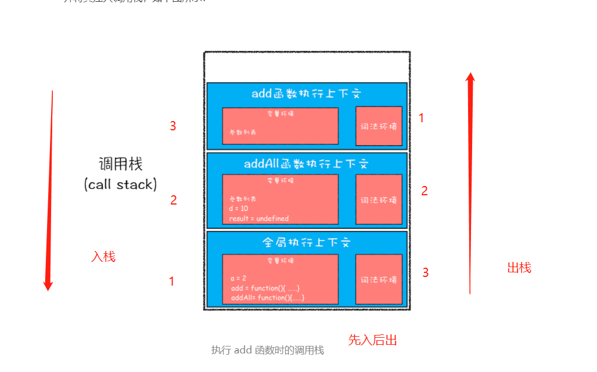

## JS 执行流程

### 一段 JS 代码-->js 引擎编译-->执行阶段


输入一段代码，经过编译后，会生成两部分内容：**执行上下文（Execution context）**和**可执行代码**。  
**执行上下文是 JavaScript 执行一段代码时的运行环境**，比如调用一个函数，就会进入这个函数的执行上下文，确定该函数在执行期间用到的诸如 this、变量、对象以及函数等。

```js
showName();
var showName = function () {
  console.log(2);
};
function showName() {
  console.log(1);
}
// 输出1

// 编译阶段:
// var showName
// function showName(){console.log(1)}

// 执行阶段:
// showName()//输出1
// showName=function(){console.log(2)}
//如果后面再有showName执行的话，就输出2因为这时候函数引用已经变了

// 如果同名的变量和函数名，变量环境中是分别保存还是如何处理的？
// 1:如果是同名的函数，JavaScript编译阶段会选择最后声明的那个。

// 2:如果变量和函数同名，那么在编译阶段，变量的声明会被忽略
```

### JavaScript 调用栈

JavaScript 引擎正是利用栈的这种结构来管理执行上下文的。在执行上下文创建好后，JavaScript 引擎会将执行上下文压入栈中，通常把这种用来管理执行上下文的栈称为**执行上下文栈**，又称**调用栈**。

```js
var a = 2;
function add(b, c) {
  return b + c;
}
function addAll(b, c) {
  var d = 10;
  result = add(b, c);
  return a + result + d;
}
addAll(3, 6);
```



### JavaScript 是如何支持块级作用域的

```js
function foo() {
  var a = 1;
  let b = 2;
  {
    let b = 3;
    var c = 4;
    let d = 5;
    console.log(a);
    console.log(b);
  }
  console.log(b);
  console.log(c);
  console.log(d);
}
foo();
```

**第一步是编译并创建执行上下文**，


- 函数内部通过 var 声明的变量，在编译阶段全都被存放到**变量环境**里面了。
- 通过 let 声明的变量，在编译阶段会被存放到**词法环境**（Lexical Environment）中。
- 执行函数时才有进行编译，抽象语法树(AST）在进入函数阶段就生成了，并且函数内部作用域是已经明确了，所以进入块级作用域不会有编译过程，只不过通过 let 或者 const 声明的变量会在进入块级作用域的时被创建，但是在该变量没有赋值之前，引用该变量 JavaScript 引擎会抛出错误---这就是“暂时性死区”
- 当执行到块级作用域的时候，块级作用域中通过 let 和 const 申明的变量会被追加到词法环境中，当这个块执行结束之后，追加到词法作用域的内容又会销毁掉。

第二步**继续执行代码**，当执行到代码块里面时，变量环境中 a 的值已经被设置成了 1，词法环境中 b 的值已经被设置成了 2，这时候函数的执行上下文就如下图所示：


在词法环境内部，维护了一个小型栈结构，栈底是函数最外层的变量（let，const），进入一个作用域块后，就会把该作用域块内部的变量压到栈顶；当作用域执行完成之后，该作用域的信息就会从栈顶弹出，这就是词法环境的结构。


**块级作用域就是通过词法环境的栈结构来实现的，而变量提升是通过变量环境来实现，通过这两者的结合，JavaScript 引擎也就同时支持了变量提升和块级作用域了。**

### 执行上下文


### 暂时性死区

- var 的创建和初始化被提升，赋值不会被提升。
- let 的创建被提升，初始化和赋值不会被提升。
- function 的创建、初始化和赋值均会被提升。

### 作用域链

```js
function bar() {
  console.log(myName);
}
function foo() {
  var myName = ' 极客邦 ';
  bar();
}
var myName = ' 极客时间 ';
foo();
```

每个执行上下文的变量环境中，都包含了一个外部引用，用来指向外部的执行上下文，我们把这个外部引用称为**outer**


bar 函数和 foo 函数的 outer 都是指向全局上下文的，这也就意味着如果在 bar 函数或者 foo 函数中使用了外部变量，那么 JavaScript 引擎会去全局执行上下文中查找。我们把这个查找的链条就称为**作用域链**

### 词法作用域

**词法作用域就是指作用域是由代码中函数声明的位置来决定的，所以词法作用域是静态的作用域，通过它就能够预测代码在执行过程中如何查找标识符。**

**词法作用域是代码阶段就决定好的，和函数是怎么调用的没有关系。**

### 闭包

**在 JavaScript 中，根据词法作用域的规则，内部函数总是可以访问其外部函数中声明的变量，当通过调用一个外部函数返回一个内部函数后，即使该外部函数已经执行结束了，但是内部函数引用外部函数的变量依然保存在内存中，我们就把这些变量的集合称为闭包**

```js
function foo() {
  var myName = ' 极客时间 ';
  let test1 = 1;
  const test2 = 2;
  var innerBar = {
    getName: function () {
      console.log(test1);
      debugger;
      return myName;
    },
    setName: function (newName) {
      myName = newName;
    },
  };
  return innerBar;
}
var bar = foo();
bar.setName(' 极客邦 ');
bar.getName();
console.log(bar.getName());
```


### this
因为静态作用域的原因，但是，在对象内部的方法中使用对象内部的属性是一个非常普遍的需求。所以出现**this 机制**

+ 在全局环境中调用一个函数，函数内部的 this 指向的是全局变量 window（其实相当于window调用函数符合第二条）。
+ 通过一个对象来调用其内部的一个方法，该方法的执行上下文中的 this 指向对象本身。