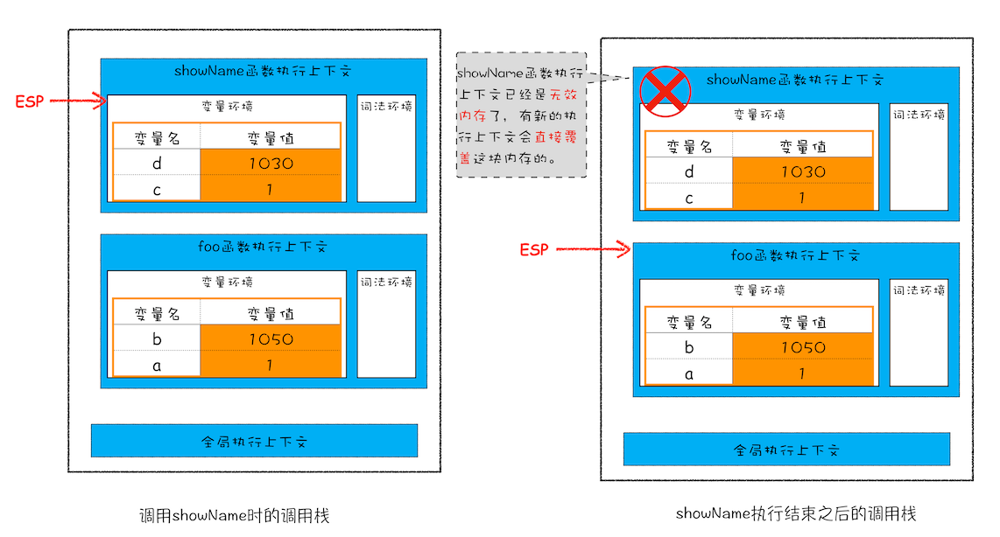

# V8垃圾回收

### 调用栈中的数据是如何回收的
 **记录当前执行状态的指针（称为 ESP）**，当一个函数执行结束之后，JavaScript 引擎会通过向下移动 ESP 来销毁该函数保存在栈中的执行上下文。  

 

### 堆中的数据是如何回收的
**代际假说**  
+ 第一个是大部分对象在内存中存在的时间很短，简单来说，就是很多对象一经分配内存，很快就变得不可访问;
+ 第二个是不死的对象，会活得更久。

在 V8 中会把堆分为新生代和老生代两个区域，新生代中存放的是生存时间短的对象，老生代中存放的生存时间久的对象。

新生区大概只有1~8M的大小。老生区大很多。**副垃圾回收器，主要负责新生代的垃圾回收。主垃圾回收器，主要负责老生代的垃圾回收。**

### 垃圾回收器的工作流程
不论什么类型的垃圾回收器，它们都有一套共同的执行流程。
+ 标记空间中活动对象和非活动对象。所谓活动对象就是还在使用的对象，非活动对象就是可以进行垃圾回收的对象。
+ 回收非活动对象所占据的内存。其实就是在所有的标记完成之后，统一清理内存中所有被标记为可回收的对象。
+ 内存整理。（不连续的内存空间称为**内存碎片**）

### 副垃圾回收器
副垃圾回收器主要负责新生区的垃圾回收。大多数小的对象都会被分配到新生区。**Scavenge 算法**
+ 主要是把新生代空间对半分为两个部分，一般是是对象空间，另一半是空闲区域。
+ 新对象都放到对象空间，快满了，执行垃圾清理操作。把存活的对象**复制到**空闲区域。（同时整理，相当于完成了内存整理操作。）
+ 复制完成后，对象区域与空闲区域进行角色翻转。（这两块区域无限重复使用下去）
+ 空间大小限制，**对象晋升策略** 经过两次垃圾回收依然还存活的对象，会被移动到老生区中。

### 主垃圾回收器
**标记-清除Mark-Sweep**算法: 首先是标记过程阶段。标记阶段就是从一组根元素开始，递归遍历这组根元素，在这个遍历过程中，**能到达的元素称为活动对象**，没有到达的元素就可以判断为垃圾数据。

**标记-清除** 产生大量不连续的内存碎片。而碎片过多会导致大对象无法分配到足够的连续内存。
**标记-整理Mark-Compact** 这个标记过程仍然与标记 - 清除算法里的是一样的，但后续步骤不是直接对可回收对象进行清理，而是让所有存活的对象都向一端移动，然后直接清理掉端边界以外的内存

### 全停顿
垃圾回收会导致正在执行的 JavaScript 脚本暂停。主要是老生代需要时间多。  

为了降低老生代的垃圾回收而造成的卡顿，V8 将标记过程分为一个个的子标记过程，同时让垃圾回收标记和 JavaScript 应用逻辑交替进行，直到标记阶段完成，我们把这个算法称为**增量标记（Incremental Marking）算法**

使用增量标记算法，**可以把一个完整的垃圾回收任务拆分为很多小的任务，这些小的任务执行时间比较短，可以穿插在其他的 JavaScript 任务中间执行**

# V8 如何执行JS代码
**编译型语言在程序执行之前，需要经过编译器的编译过程，并且编译之后会直接保留机器能读懂的二进制文件，这样每次运行程序时，都可以直接运行该二进制文件，而不需要再次重新编译了**。比如 C/C++、GO 等都是编译型语言。

**解释型语言编写的程序，在每次运行时都需要通过解释器对程序进行动态解释和执行**。比如 Python、JavaScript 等都属于解释型语言。

### 编译器和解释器

## V8 执行一段代码流程图
**V8 在执行过程中既有解释器 Ignition，又有编译器 TurboFan**.

### 生成抽象语法树（AST）和执行上下文

将源代码转换为抽象语法树，并生成执行上下文。如何生成AST：
+ 第一阶段是**分词（tokenize）**，又称为词法分析，其作用是将一行行的源码拆解成一个个 token。所谓token，指的是语法上不可能再分的、最小的单个字符或字符串
+ 第二阶段是**解析（parse）**，又称为语法分析，其作用是将上一步生成的 token 数据，根据语法规则转为 AST。如果源码符合语法规则，这一步就会顺利完成。但如果源码存在语法错误，这一步就会终止，并抛出一个“语法错误”。

### 生成字节码
解释器 Ignition 就登场了，它会根据 AST 生成字节码，并解释执行字节码。

**字节码就是介于 AST 和机器码之间的一种代码。但是与特定类型的机器码无关，字节码需要通过解释器将其转换为机器码后才能执行。**

一开始都是直接生成机器码，由于机器码占用内存大，所以采用现在这种字节码的形式。

### 执行代码
生成字节码之后，接下来就要进入执行阶段。
+ 通常 解释器 Ignition 会逐条解释执行。
+ 发现有**热点代码（HotSpot）**，（比如一段代码被重复执行多次，这种就称为热点代码。）后台的编译器 TurboFan 就会把该段热点的字节码编译为高效的机器码，然后当再次执行这段被优化的代码时，只需要执行编译后的机器码就可以了，这样就大大提升了代码的执行效率。
+ 编译时间越长，执行效率越高。**因为热点代码都被编译器 TurboFan 转换了机器码，直接执行机器码就省去了字节码“翻译”为机器码的过程。**

**字节码配合解释器和编译器是最近一段时间很火的技术，比如 Java 和 Python 的虚拟机也都是基于这种技术实现的，我们把这种技术称为即时编译（JIT）**

