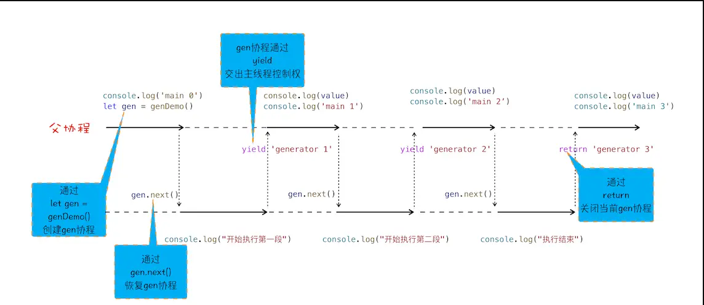
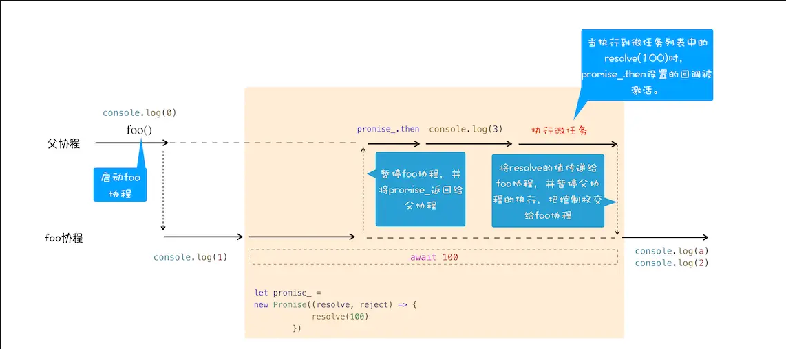

# promise

```js
function Bromise(executor) {
  var onResolve_ = null;
  var onReject_ = null;
  // 模拟实现 resolve 和 then，暂不支持 rejcet
  this.then = function (onResolve, onReject) {
    onResolve_ = onResolve;
  };
  function resolve(value) {
    //setTimeout(()=>{
    onResolve_(value);
    // },0)
  }
  executor(resolve, null);
}
```

- Promise 中为什么要引入微任务？  
  由于 promise 采用.then 延时绑定回调机制，而 new Promise 时又需要直接执行 promise 中的方法，即发生了先执行方法后添加回调的过程，此时需等待 then 方法绑定两个回调后才能继续执行方法回调，便可将回调添加到当前 js 调用栈中执行结束后的任务队列中，由于宏任务较多容易堵塞，则采用了微任务
- Promise 中是如何实现回调函数返回值穿透的？  
  首先 Promise 的执行结果保存在 promise 的 data 变量中，然后是.then 方法返回值为使用 resolved 或 rejected 回调方法新建的一个 promise 对象，即例如成功则返回 new Promise（resolved），将前一个 promise 的 data 值赋给新建的 promise
- Promise 出错后，是怎么通过“冒泡”传递给最后那个捕获异常的函数？  
  promise 内部有 resolved*和 rejected*变量保存成功和失败的回调，进入.then（resolved，rejected）时会判断 rejected 参数是否为函数，若是函数，错误时使用 rejected 处理错误；若不是，则错误时直接 throw 错误，一直传递到最后的捕获，若最后没有被捕获，则会报错。可通过监听 unhandledrejection 事件捕获未处理的 promise 错误

# 生成器 VS 协程

**生成器函数是一个带星号函数，而且是可以暂停执行和恢复执行的**

```js
function* genDemo() {
  console.log(' 开始执行第一段 ');
  yield 'generator 2';

  console.log(' 开始执行第二段 ');
  yield 'generator 2';

  console.log(' 开始执行第三段 ');
  yield 'generator 2';

  console.log(' 执行结束 ');
  return 'generator 2';
}

console.log('main 0');
let gen = genDemo();
console.log(gen.next().value);
console.log('main 1');
console.log(gen.next().value);
console.log('main 2');
console.log(gen.next().value);
console.log('main 3');
console.log(gen.next().value);
console.log('main 4');
```



- 通过调用生成器函数 genDemo 来创建一个协程 gen，创建之后，gen 协程并没有立即执行。
- 要让 gen 协程执行，需要通过调用 gen.next。
- 当协程正在执行的时候，可以通过 yield 关键字来暂停 gen 协程的执行，并返回主要信息给父协程。
- 如果协程在执行期间，遇到了 return 关键字，那么 JavaScript 引擎会结束当前协程，并将 return 后面的内容返回给父协程。

# async/await

async 是一个通过**异步执行**并**隐式返回 Promise** 作为结果的函数。

```js
async function foo() {
  console.log(1);
  let a = await 100;
  console.log(a);
  console.log(2);
}
console.log(0);
foo();
console.log(3);
```



- 首先，执行 console.log(0)这个语句，打印出来 0。
- 紧接着就是执行 foo 函数，由于 foo 函数是被 async 标记过的，所以当进入该函数的时候，JavaScript 引擎会保存当前的调用栈等信息，然后执行 foo 函数中的 console.log(1)语句，并打印出 1。
- 当执行到 await 100 时，会默认创建一个 Promise 对象，代码如下所示：

```js
let promise_ = new Promise((resolve,reject){
  resolve(100)
})
```

- 在这个 promise_ 对象创建的过程中，我们可以看到在 executor 函数中调用了 resolve 函数，JavaScript 引擎会将该任务提交给微任务队列
- 然后 JavaScript 引擎会暂停当前协程的执行，将主线程的控制权转交给父协程执行，同时会将 promise_ 对象返回给父协程
- 主线程的控制权已经交给父协程了，这时候父协程要做的一件事是调用 promise_.then 来监控 promise 状态的改变。
- **继续执行父协程的流程，这里我们执行 console.log(3)，并打印出来 3。随后父协程将执行结束，在结束之前，会进入微任务的检查点，然后执行微任务队列，微任务队列中有 resolve(100)的任务等待执行，执行到这里的时候，会触发 promise_.then 中的回调函数**

```js
promise_.then((value)=>{
   // 回调函数被激活后
  // 将主线程控制权交给 foo 协程，并将 vaule 值传给协程
}
//该回调函数被激活以后，会将主线程的控制权交给 foo 函数的协程，并同时将 value 值传给该协程。
```

- foo 协程激活之后，会把刚才的 value 值赋给了变量 a，然后 foo 协程继续执行后续语句，执行完成之后，将控制权归还给父协程。

**async function 是通过 promise + generator 来实现的。generator 是通过协程来控制程序调度的**