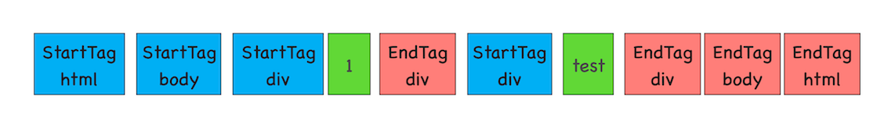

# DOM 树构建

在渲染引擎内部，有一个叫**HTML 解析器（HTMLParser）**的模块，它的职责就是负责将 HTML 字节流转换为 DOM 结构。

**网络进程加载了多少数据，HTML 解析器便解析多少数据。**

渲染进程准备好之后，**网络进程和渲染进程之间会建立一个共享数据的管道**，网络进程接收到数据后就往这个管道里面放，而渲染进程则从管道的另外一端不断地读取数据，并同时将读取的数据传给 HTML 解析器

- 通过分词器将字节流转换为 Token
  
- 后续的第二个和第三个阶段是同步进行的，需要将 Token 解析为 DOM 节点，并将 DOM 节点添加到 DOM 树中。  
  HTML 解析器维护了一个 Token 栈结构，该 Token 栈主要用来计算节点之间的父子关系，在第一个阶段中生成的 Token 会被按照顺序压到这个栈中

- **JavaScript 文件的下载过程会阻塞 DOM 解析**
- **如果代码里引用了外部的 CSS 文件，那么在执行 JavaScript 之前，还需要等待外部的 CSS 文件下载完成，并解析生成 CSSOM 对象之后，才能执行 JavaScript 脚本**
- **CSS 不阻塞 js 的加载，但是可能会阻塞 js 的执行**
- **js 会阻塞 dom 的生成，也就是会阻塞页面的渲染，那么 css 也有可能会阻塞页面的渲染。**

# CSSOM

cssom 作用：**第一个是提供给 JavaScript 操作样式表的能力，第二个是为布局树的合成提供基础的样式信息**

DOM 和 CSSOM 都构建好之后，渲染引擎就会**构造布局树**。布局树的结构基本上就是复制 DOM 树的结构，不同之处在于 DOM 树中那些不需要显示的元素会被过滤掉，如 display:none 属性的元素、head 标签、script 标签等。

复制好基本的布局树结构之后，渲染引擎会为对应的 DOM 元素选择对应的样式信息，这个过程就是**样式计算**。

样式计算完成之后，渲染引擎还需要计算布局树中每个元素对应的几何位置，这个过程就是**计算布局**。

通过样式计算和计算布局就完成了**最终布局树**的构建。再之后，就该进行后续的绘制操作了。

# 影响页面展示的因素以及优化策略

发起 URL 请求开始，到首次显示页面的内容，在视觉上经历的三个阶段。

1. 第一个阶段，等请求发出去之后，到提交数据阶段，这时页面展示出来的还是之前页面的内容
2. 提交数据之后渲染进程会创建一个空白页面，我们通常把这段时间称为**解析白屏**，并等待 CSS 文件和 JavaScript 文件的加载完成，生成 CSSOM 和 DOM，然后合成布局树，最后还要经过一系列的步骤准备首次渲染。
3. 等首次渲染完成之后，就开始进入完整页面的生成阶段了，然后页面会一点点被绘制出来

第二个阶段瓶颈： **下载 CSS 文件、下载 JavaScript 文件和执行 JavaScript。**