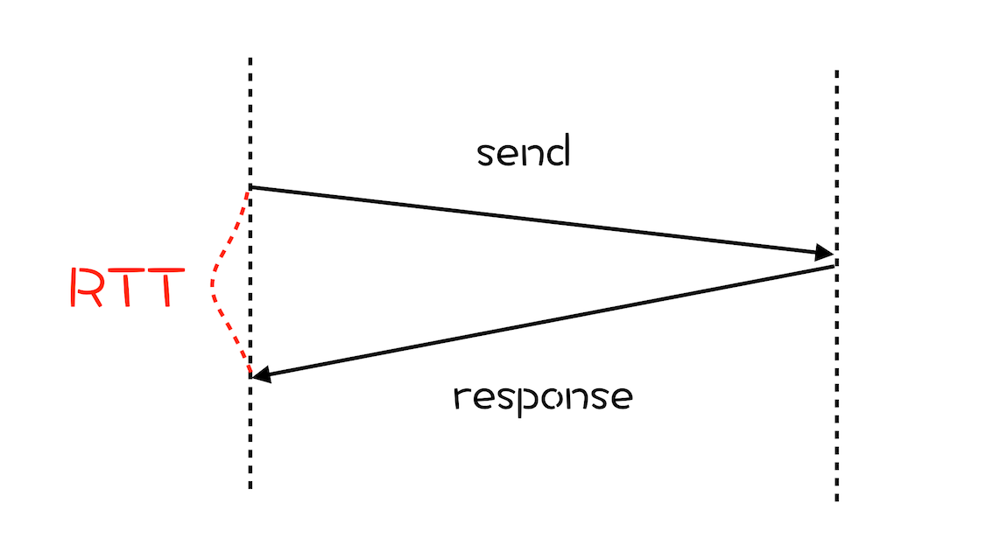
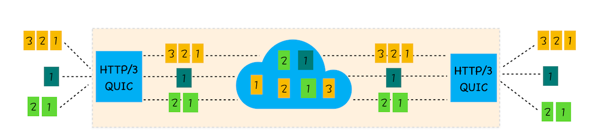

# HTTP/1.1

## 优化

- 增加了持久连接；
- 浏览器为每个域名最多同时维护 6 个 TCP 持久连接；
- 使用 CDN 的实现域名分片机制。

## 问题

对带宽的利用率不理想

- **TCP 的慢启动**。  
  一旦一个 TCP 连接建立之后，就进入了发送数据状态，刚开始 TCP 协议会采用一个非常慢的速度去发送数据，然后慢慢加快发送数据的速度，直到发送数据的速度达到一个理想状态，我们把这个过程称为慢启动。
- **同时开启了多条 TCP 连接，那么这些连接会竞争固定的带宽**。  
  因为有的 TCP 连接下载的是一些关键资源，如 CSS 文件、JavaScript 文件等，而有的 TCP 连接下载的是图片、视频等普通的资源文件，但是多条 TCP 连接之间又不能协商让哪些关键资源优先下载，这样就有可能影响那些关键资源的下载速度了。
- **HTTP/1.1 队头阻塞的问题**  
  虽然能公用一个 TCP 管道，但是在一个管道中同一时刻只能处理一个请求，在当前的请求没有结束之前，其他的请求只能处于阻塞状态。这意味着我们不能随意在一个管道中发送请求和接收内容。

# HTTP/2 的多路复用

前面我们分析了 HTTP/1.1 所存在的一些主要问题：慢启动和 TCP 连接之间相互竞争带宽是由于 TCP 本身的机制导致的，而队头阻塞是由于 HTTP/1.1 的机制导致的。

HTTP/2 的思路就是一个域名只使用一个 TCP 长连接来传输数据，这样整个页面资源的下载过程只需要一次慢启动，同时也避免了多个 TCP 连接竞争带宽所带来的问题。

另外，就是队头阻塞的问题，等待请求完成后才能去请求下一个资源，这种方式无疑是最慢的，所以 HTTP/2 需要实现资源的并行请求，也就是任何时候都可以将请求发送给服务器，而并不需要等待其他请求的完成，然后服务器也可以随时返回处理好的请求资源给浏览器。

HTTP/2 的解决方案可以总结为：**一个域名只使用一个 TCP 长连接和消除队头阻塞问题**。

## 实现多路复用

HTTP/2 添加了一个二进制分帧层

- 首先，浏览器准备好请求数据，包括了请求行、请求头等信息，如果是 POST 方法，那么还要有请求体
- 这些数据经过二进制分帧层处理之后，会被转换为一个个带有请求 ID 编号的帧，通过协议栈将这些帧发送给服务器。
- 服务器接收到所有帧之后，会将所有相同 ID 的帧合并为一条完整的请求信息。
- 服务器处理该条请求，并将处理的响应行、响应头和响应体分别发送至二进制分帧层。
- 二进制分帧层会将这些响应数据转换为一个个带有请求 ID 编号的帧，经过协议栈发送给浏览器。
- 浏览器接收到响应帧之后，会根据 ID 编号将帧的数据提交给对应的请求。

### 可以设置请求的优先级

### 服务器推送

HTTP/2 还可以直接将数据提前推送到浏览器。你可以想象这样一个场景，当用户请求一个 HTML 页面之后，服务器知道该 HTML 页面会引用几个重要的 JavaScript 文件和 CSS 文件，那么在接收到 HTML 请求之后，附带将要使用的 CSS 文件和 JavaScript 文件一并发送给浏览器，这样当浏览器解析完 HTML 文件之后，就能直接拿到需要的 CSS 文件和 JavaScript 文件，这对首次打开页面的速度起到了至关重要的作用

### 头部压缩

压缩请求头

## HTTP2 问题

### TCP 的队头阻塞

**在 TCP 传输过程中，由于单个数据包的丢失而造成的阻塞称为 TCP 上的队头阻塞。**
HTTP/2 中，多个请求是跑在一个 TCP 管道中的，如果其中任意一路数据流中出现了丢包的情况，那么就会阻塞该 TCP 连接中的所有请求。  
随着丢包率的增加，HTTP/2 的传输效率也会越来越差。有测试数据表明，当系统达到了 2% 的丢包率时，HTTP/1.1 的传输效率反而比 HTTP/2 表现得更好。

### TCP 建立连接的延时

除了 TCP 队头阻塞之外，TCP 的握手过程也是影响传输效率的一个重要因素。
**网络延迟又称为 RTT（Round Trip Time）**。我们把从浏览器发送一个数据包到服务器，再从服务器返回数据包到浏览器的整个往返时间称为 RTT

- 在建立 TCP 连接的时候，需要和服务器进行三次握手来确认连接成功，也就是说需要在消耗完 1.5 个 RTT 之后才能进行数据传输。
- 如果是 HTTPS，还要进行 TLS 连接，TLS 有两个版本——TLS1.2 和 TLS1.3，每个版本建立连接所花的时间不同，大致是需要 1 ～ 2 个 RTT。

# HTTP3 QUIC 协议

TCP 协议僵化，由于设备和操作系统的原因，几乎不可修改。所以**基于 UDP 实现了类似于 TCP 的多路数据流、传输可靠性等功能，我们把这套功能称为 QUIC 协议**

- **实现了类似 TCP 的流量控制、传输可靠性的功能**。虽然 UDP 不提供可靠性的传输，但 QUIC 在 UDP 的基础之上增加了一层来保证数据可靠性传输。它提供了数据包重传、拥塞控制以及其他一些 TCP 中存在的特性。
- **集成了 TLS 加密功能**。目前 QUIC 使用的是 TLS1.3，相较于早期版本 TLS1.3 有更多的优点，其中最重要的一点是减少了握手所花费的 RTT 个数。
- **实现了 HTTP/2 中的多路复用功能**。和 TCP 不同，QUIC 实现了在**同一物理连接上可以有多个独立的逻辑数据流**（如下图）。实现了数据流的单独传输，就解决了 TCP 中队头阻塞的问题。

  

- **实现了快速握手功能**。由于 QUIC 是基于 UDP 的，所以 QUIC 可以实现使用 0-RTT 或者 1-RTT 来建立连接，这意味着 QUIC 可以用最快的速度来发送和接收数据，这样可以大大提升首次打开页面的速度。

# 队头阻塞
- HTTP/1.1 有队头阻塞，因为它需要完整地发送响应，并且不能多路复用它们
- HTTP/2 通过引入“帧”（frames）标识每个资源块属于哪个“流”（stream）来解决这个问题
- 然而，TCP 不知道这些单独的“流”（streams），只是把所有的东西看作一个大流（1 big stream）
- 如果一个 TCP 包丢失，所有后续的包都需要等待它的重传，即使它们包含来自不同流的无关联数据。TCP 具有传输层队头阻塞。

[队头阻塞](https://zhuanlan.zhihu.com/p/330300133)

 HTTP/1.1 会受到**应用层队头阻塞**的影响。这主要是因为 HTTP/1.1 没有识别单个资源块的方法。HTTP/2 使用帧来标记这些块并启用多路复用。这解决了 HTTP/1.1 的问题

 HTTP/2 仍然受到底层 TCP 的限制。由于 TCP 将 HTTP/2 数据抽象为一个单一的、有序的、但不透明的流，因此如果数据包在网络上丢失或严重延迟，它将遭受队头阻塞(**传输层队头阻塞**)