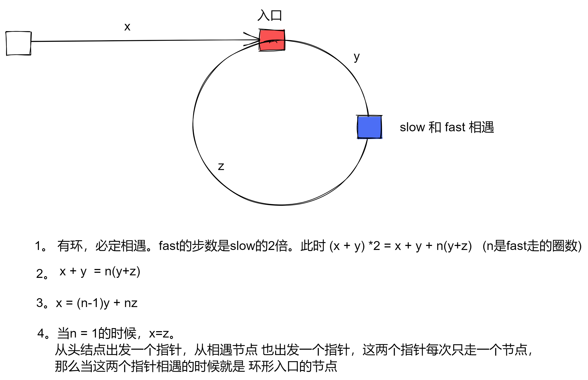

# 141. 环形链表

- 快慢指针
- 总结快慢指针的特性 —— 每轮移动之后两者的距离会加一。
- 当在换里第二次相遇时候, 第一次和第二次的移动间隔就是环的长度

```js
var hasCycle = function (head) {
  if (head == null || head.next == null) return false;
  var slow = head;
  var fast = head;
  while (fast && fast.next) {
    fast = fast.next.next;
    slow = slow.next;
    if (slow == fast) return true;
  }
  return false;
};
```
# 142. 环形链表 II
- 第一点判断是不是有环, 快慢指针, 如果有环, 必定在环内相遇.
- 第二有环,如何求换的入口



```js
/**
 * @param {ListNode} head
 * @return {ListNode}
 */
var detectCycle = function (head) {
  var slow = head;
  var fast = head;
  var a = head;
  while (fast != null && fast.next != null) {
    slow = slow.next;
    fast = fast.next.next;
    if (slow == fast) {
      var b = slow;
      while (a != b) {
        a = a.next;
        b = b.next;
      }
      return a;
    }
  }
  return null;
};
```