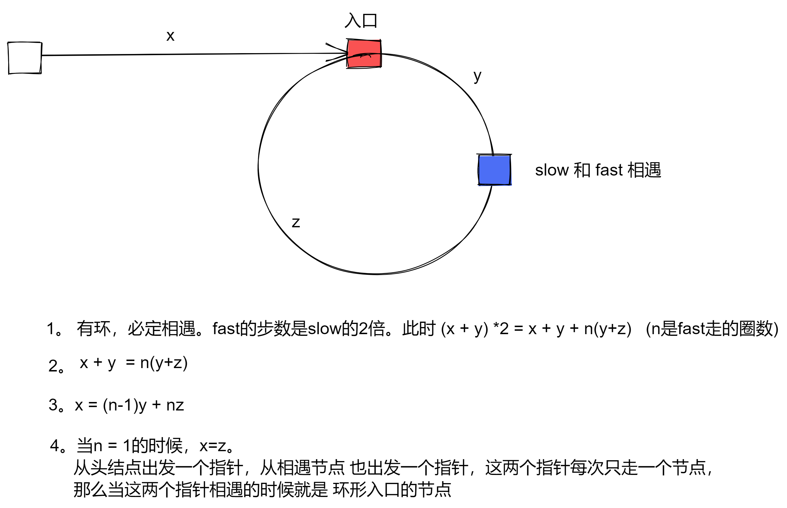

# 环形链表 II

求一个链表是否有环, 如果有环,返回环的入口, 如果链表无环，则返回 null
https://leetcode-cn.com/problems/linked-list-cycle-ii/

- 第一点判断是不是有环, 快慢指针, 如果有环, 必定在环内相遇.
- 第二有环,如何求换的入口



```js
/**
 * Definition for singly-linked list.
 * function ListNode(val) {
 *     this.val = val;
 *     this.next = null;
 * }
 */

/**
 * @param {ListNode} head
 * @return {ListNode}
 */
var detectCycle = function (head) {
  var slow = head;
  var fast = head;
  var a = head;
  while (fast != null && fast.next != null) {
    slow = slow.next;
    fast = fast.next.next;
    if (slow == fast) {
      var b = slow;
      while (a != b) {
        a = a.next;
        b = b.next;
      }
      return a;
    }
  }
  return null;
};
```
