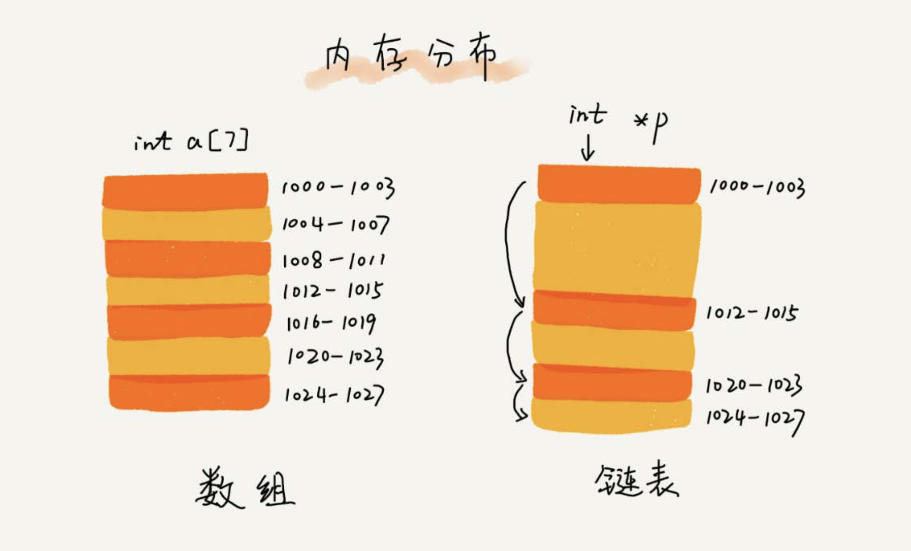
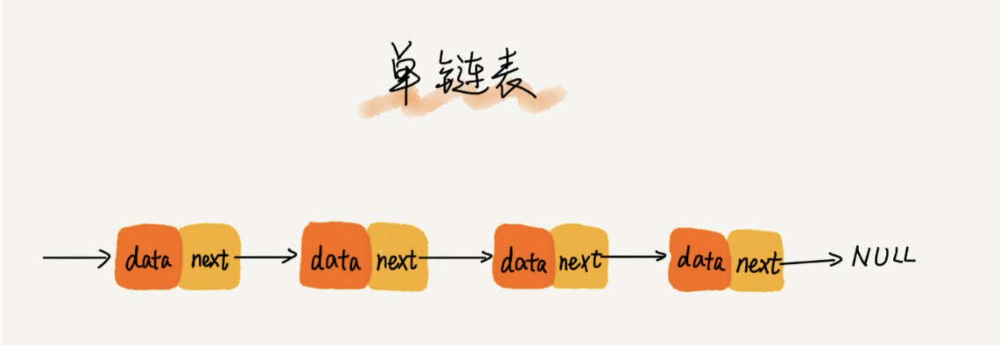
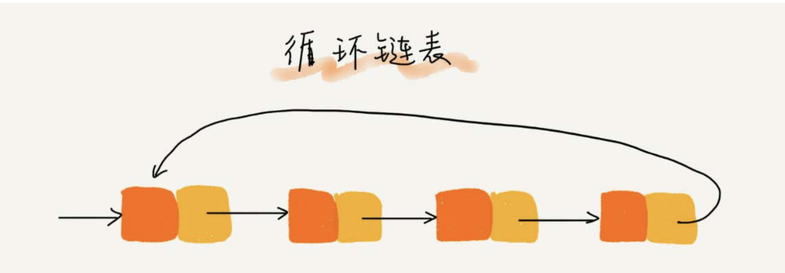
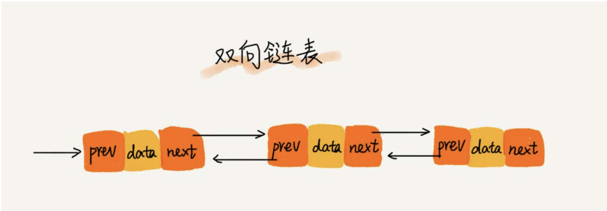
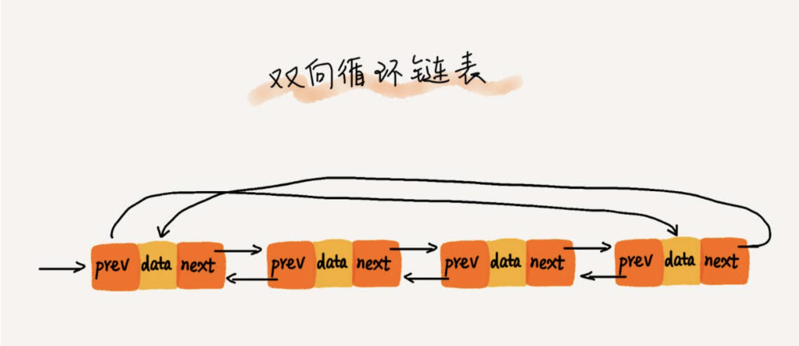

## 链表
链表并不需要一块连续的内存空间，它通过“指针”将一组零散的内存块串联起来使用。
针对链表的插入和删除操作，我们只需要考虑相邻结点的指针改变，所以对应的时间复杂度是O(1)。但是想要‘随机访问’只能节点遍历。O(n)

#### 单链表
链表通过指针将一组零散的内存块串联在一起。其中，我们把内存块称为链表的“结点”。为了将所有的结点串起来，每个链表的结点除了存储数 据之外，还需要记录链上的下一个结点的地址。如图所示，我们把这个记录下个结点地址的指针叫作后继指针next。

#### 循环链表
循环链表是一种特殊的单链表。实际上，循环链表也很简单。它跟单链表唯一的区别就在尾结点。我们知道，单链表的尾结点指针指向空地址，表示这就是最后 的结点了。而循环链表的尾结点指针是指向链表的头结点。

#### 双向链表
单向链表只有一个方向，结点只有一个后继指针next指向后面的结点。而双向链表，顾名思义，它支持两个方向，每个结点不止有一个后继指针next指向后面的结 点，还有一个前驱指针prev指向前面的结点。

+ 双向链表需要额外的两个空间来存储后继结点和前驱结点的地址。所以，如果存储同样多的数据，双向链表要比单链表占用更多的内存空间 （空间换时间）
+ 支持双向遍历，这样也带来了双向链表操作的灵活性。
+ 双向链表可以支持O(1)时间复杂度的情况下找到前驱结点。

#### 双向循环链表

