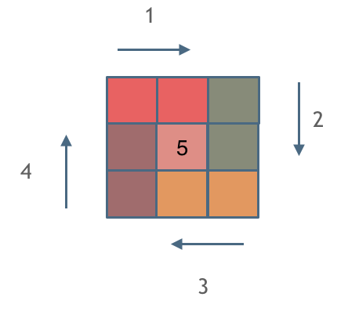

# 59. 螺旋矩阵 II

给你一个正整数 n ，生成一个包含 1 到 n2 所有元素，且元素按顺时针顺序螺旋排列的 n x n 正方形矩阵 matrix

```
输入：n = 3
输出：[[1,2,3],[8,9,4],[7,6,5]]
```
- 填充上行从左到右
- 填充右列从上到下
- 填充下行从右到左
- 填充左列从下到上

一圈下来，我们要画每四条边，每画一条边都要坚持一致的左闭右开   



```js
/**
 * @param {number} n
 * @return {number[][]}
 */
var generateMatrix = function (n) {
  var startx = (starty = x = y = 0); // 起始位置
  var loop = n >> 1; //循环次数
  var count = 1; //填入的数字
  var offset = 1; // 每一圈循环，需要控制每一条边遍历的长度
  var res = Array.from({ length: n }).map(() => Array.from({ length: n }));
  while (loop--) {
    x = startx;
    y = starty;
    // 下面开始的四个for就是模拟转了一圈
    // 模拟填充上行从左到右(左闭右开)  [starty, n - offset)
    for (y = starty; y < starty + n - offset; y++) {
      res[startx][y] = count++;
    }
    // 模拟填充右列从上到下(左闭右开) [startx, n - offset)
    for (x = startx; x < startx + n - offset; x++) {
      res[x][y] = count++;
    }
    // 模拟填充下行从右到左(左闭右开) [n-offset, starty]
    for (; y > starty; y--) {
      res[x][y] = count++;
    }
    // 模拟填充左列从下到上(左闭右开) [n-offset, startx]
    for (; x > startx; x--) {
      res[x][y] = count++;
    }
    // 第二圈开始的时候，起始位置要各自加1， 例如：第一圈起始位置是(0, 0)，第二圈起始位置是(1, 1)
    startx++;
    starty++;

    // offset 控制每一圈里每一条边遍历的长度
    offset += 2;
  }
  // 是奇数，补上最中间的一个数字
  if (n & 1) res[startx][starty] = count;
  return res;
};
```
