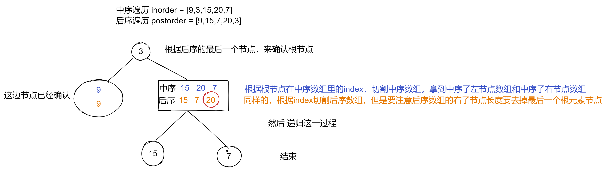

# 106. 从中序与后序遍历序列构造二叉树

https://leetcode-cn.com/problems/construct-binary-tree-from-inorder-and-postorder-traversal/  
根据一棵树的中序遍历与后序遍历构造二叉树。

注意:
你可以假设树中没有重复的元素。

例如，给出
中序遍历 inorder = [9,3,15,20,7]
后序遍历 postorder = [9,15,7,20,3]
返回如下的二叉树：

```
    3
   / \
  9  20
    /  \
   15   7
```

以后序数组的最后一个元素为切割点，先切中序数组，根据中序数组，反过来在切后序数组。一层一层切下去，每次后序数组最后一个元素就是节点元素。

- 如果数组大小为零的话，说明是空节点了。
- 如果不为空，那么取后序数组最后一个元素作为节点元素。
- 找到后序数组最后一个元素在中序数组的位置，作为切割点
- 切割中序数组，切成中序左数组和中序右数组 （顺序别搞反了，一定是先切中序数组）
- 切割后序数组，切成后序左数组和后序右数组
- 递归



```js
/**
 * Definition for a binary tree node.
 * function TreeNode(val, left, right) {
 *     this.val = (val===undefined ? 0 : val)
 *     this.left = (left===undefined ? null : left)
 *     this.right = (right===undefined ? null : right)
 * }
 */
/**
 * @param {number[]} inorder
 * @param {number[]} postorder
 * @return {TreeNode}
 */
var buildTree = function (inorder, postorder) {
  if (postorder.length === 0) return null;

  var node = postorder[postorder.length - 1];
  var root = new TreeNode(node);

  var index = inorder.findIndex(val => val === node);

  root.left = buildTree(inorder.slice(0, index), postorder.slice(0, index));
  root.right = buildTree(inorder.slice(index + 1, inorder.length), postorder.slice(index, postorder.length - 1));

  return root;
};
```
