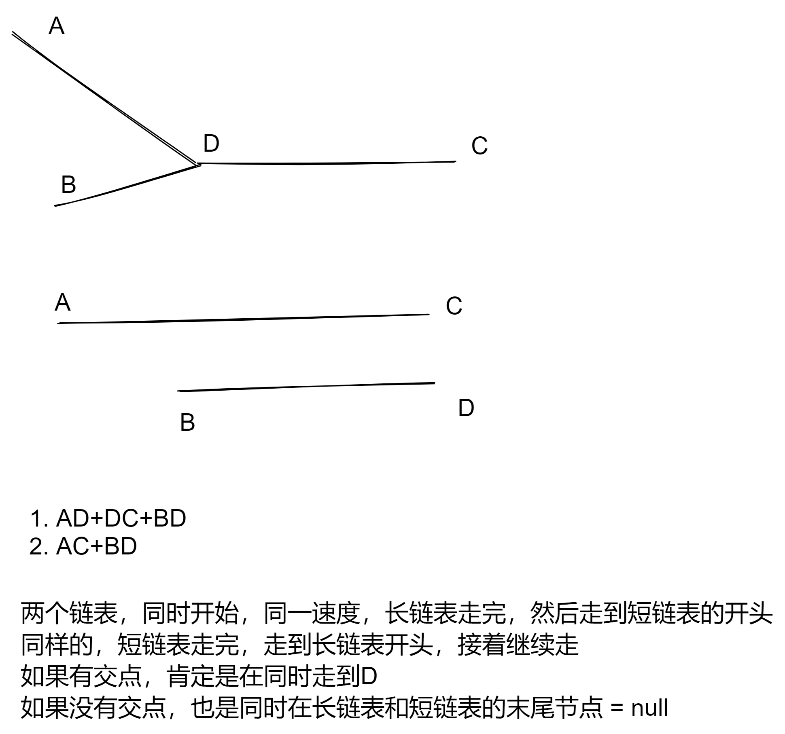

# 链表相交

https://leetcode-cn.com/problems/intersection-of-two-linked-lists-lcci/

给你两个单链表的头节点  headA 和 headB ，请你找出并返回两个单链表相交的起始节点。如果两个链表没有交点，返回 null 。

题目数据 保证 整个链式结构中不存在环。

注意，函数返回结果后，链表必须 保持其原始结构 。

```js
/**
 * Definition for singly-linked list.
 * function ListNode(val) {
 *     this.val = val;
 *     this.next = null;
 * }
 */

/**
 * @param {ListNode} headA
 * @param {ListNode} headB
 * @return {ListNode}
 */
// 时间复杂度 O(n^2)
var getIntersectionNode = function (headA, headB) {
  while (headA) {
    var p2 = headB;
    while (p2) {
      if (p2 === headA) return p2;
      p2 = p2.next;
    }
    headA = headA.next;
  }
  return null;
};
// 时间复杂度 O(n+m)
var getIntersectionNode = function (headA, headB) {
  let A = headA;
  let B = headB;
  while (A !== B) {
    A = A !== null ? A.next : headB;
    B = B !== null ? B.next : headA;
  }
  return A;
};
```
