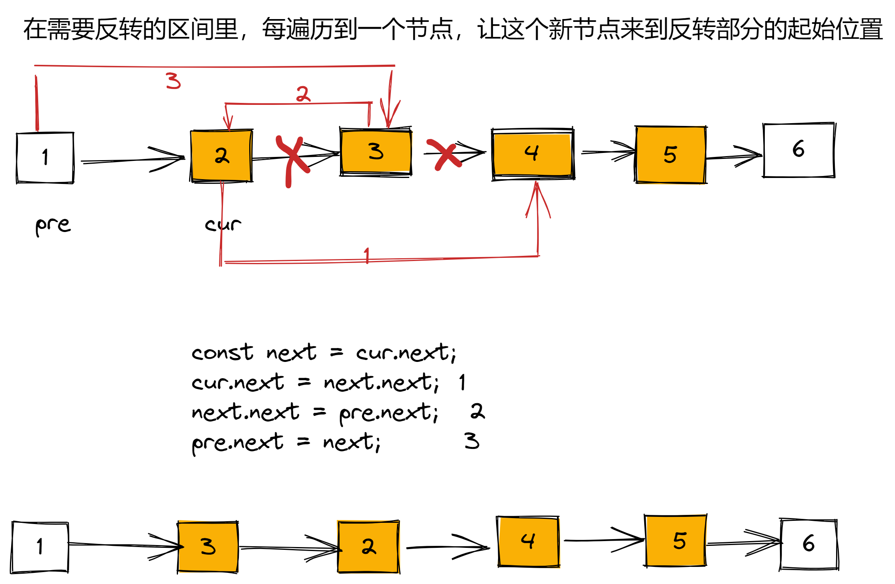

```js
/**
 * Definition for singly-linked list.
 * function ListNode(val, next) {
 *     this.val = (val===undefined ? 0 : val)
 *     this.next = (next===undefined ? null : next)
 * }
 */
// 反转链表进阶  https://leetcode-cn.com/problems/reverse-linked-list-ii/submissions/
/**
 * @param {ListNode} head
 * @param {number} left
 * @param {number} right
 * @return {ListNode}
 */
var reverseList = function (head) {
  var prev = null;
  var cur = head;
  while (cur != null) {
    var next = cur.next;
    cur.next = prev;
    prev = cur;
    cur = next;
  }
};
var reverseBetween = function (head, left, right) {
  // 虚拟节点
  var dh = new ListNode(0);
  dh.next = head;
  var a, b, c, d;
  a = dh;
  // 找出 a,b,c, d 节点的位置
  for (let i = 0; i < left - 1; i++) {
    a = a.next;
  }
  c = a;
  for (let i = 0; i < right - left + 1; i++) {
    c = c.next;
  }
  console.log(a, c);
  b = a.next;
  d = c.next;
  // 切断链表
  a.next = null;
  c.next = null;
  // 反转截取出来的链表
  reverseList(b);
  // 拼接回去
  a.next = c;
  b.next = d;

  return dh.next;
};

// 在需要反转的区间里，每遍历到一个节点，让这个新节点来到反转部分的起始位置
var reverseBetween = function (head, left, right) {
  // 虚拟节点
  var dh = new ListNode(0);
  dh.next = head;
  let pre = dh;
  // 找出 pre cur;
  for (let i = 0; i < left - 1; i++) {
    pre = pre.next;
  }

  let cur = pre.next;
  for (let i = 0; i < right - left; i++) {
    const next = cur.next;
    cur.next = next.next;
    next.next = pre.next;
    pre.next = next;
  }
  return dh.next;
};
```
