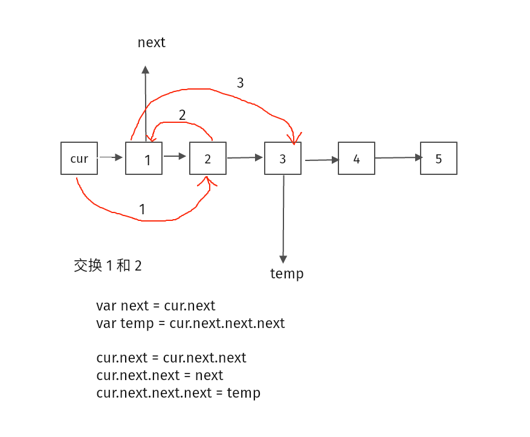

# 24. 两两交换链表中的节点

给定一个链表，两两交换其中相邻的节点，并返回交换后的链表。

你不能只是单纯的改变节点内部的值，而是需要实际的进行节点交换。

输入：head = [1,2,3,4]
输出：[2,1,4,3]


- 题目很好理解，交换节点
- 用一个虚拟头
- 一定要画图来操作链表  

  

```js
/**
 * Definition for singly-linked list.
 * function ListNode(val, next) {
 *     this.val = (val===undefined ? 0 : val)
 *     this.next = (next===undefined ? null : next)
 * }
 */
/**
 * @param {ListNode} head
 * @return {ListNode}
 */
var swapPairs = function (head) {
  var dh = new ListNode(-1);
  dh.next = head;
  var cur = dh;
  while (cur.next && cur.next.next) {
    var next2 = cur.next.next.next;
    var next = cur.next;

    cur.next = cur.next.next;
    cur.next.next = next;
    cur.next.next.next = next2;

    cur = cur.next.next;
  }
  return dh.next;
};
```
