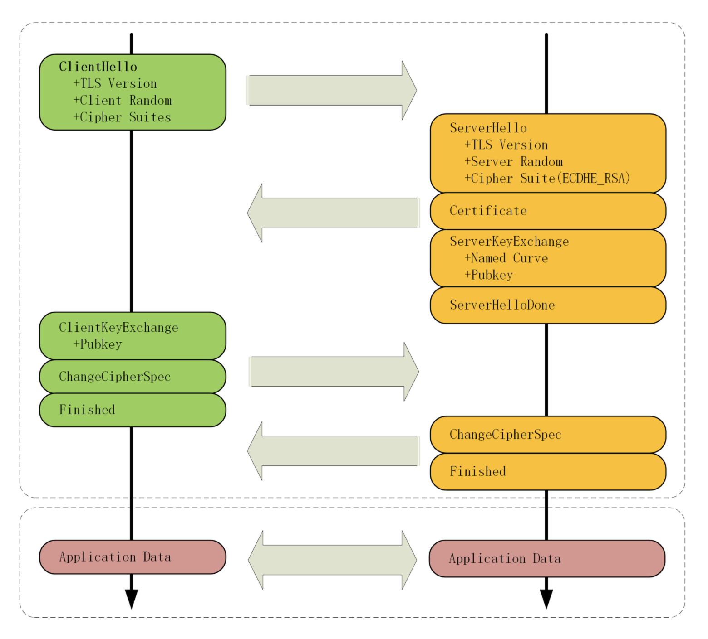

## HTTPS的TLS链接

### HTTPS建立链接
1. 浏览器首先要从URI里提取出协议名和域名。
2. DNS解析域名，得到目标的IP地址。
3. 使用三次握手与网站建立TCP连接了。
4. TLS握手。
5. 秘文发送报文

### TSL协议组成
+ **记录协议(Record Protocol)** 规定了TLS收发数据的基本单位:记录(record)。
+ **警报协议(Alert Protocol)** 职责是向对方发出警报信息，有点像是HTTP协议里的状态码。
+ **握手协议(Handshake Protocol)** 浏览器和服务 器会在握手过程中协商TLS版本号、随机数、密码套件等信息，然后交换证书和密钥参数，最终双方协商得 到会话密钥，用于后续的混合加密系统。
+ **变更密码规范协议(Change Cipher Spec Protocol)** 一个“通知”，告诉对 方，后续的数据都将使用加密保护。那么反过来，在它之前，数据都是明文的。

### TSL握手过程
原理就是混合加密。用三个随机数**Client Random**、**Server Random**和**Pre-Master**，生成密钥 **Master Secret** 。

下面看下具体过程，关键在于随机数**Pre-Master**的生成和交换。

#### clientHello
1. 随机数 **Client Random**。
2. 协议版本号 TLS Version。
3. 客户端所支持的算法、密码套件。

#### ServerHello
1. 随机数 **Server Random**
2. 协议版本号
3. 使用的密码套件
4. 证书 **Server Certificate** 服务器端配置对应的证书链，用于身份验证与密钥交换;
5. 发送**Server Key Exchange**消息，里面是椭圆曲线的公钥(Server Params)，用来实现密钥交换算法，再加上自己的私钥签名认证。

第一个消息往返就结束了(两个TCP包)，结果是客户端和服务器通过明文共享了三个信息:Client Random、Server Random和Server Params。
****

#### client Key Change
1. 先验证证书和签名
2. 客户端按照密码套件的要求，也生成一个椭圆曲线的公钥（Client Params）
3. 通过client_key_exchange，把（Client Params）发送给服务器
4. 客户端通过（Client Params）和 (Server Params) 算出 **Pre-Master**
5. 通过Client Random、Server Random和Pre-Master 算出 **Master Secret**

#### 服务器接收（Client Params）
1. 服务器通过（Client Params）和 (Server Params) 算出 **Pre-Master**
2. 通过Client Random、Server Random和Pre-Master 算出 **Master Secret**
****

#### 测试密钥
1. 客户端发一个“Change Cipher Spec”，然后再发一个“Finished”消息，把之前所有发送的数据做个摘要，再加密一下，让服务器做个验证。
2. 服务器发“Change Cipher Spec”和“Finished”消息，双方都验证加密解密OK，握手正式结束，后面就收发被加密的HTTP请求和响应了。

