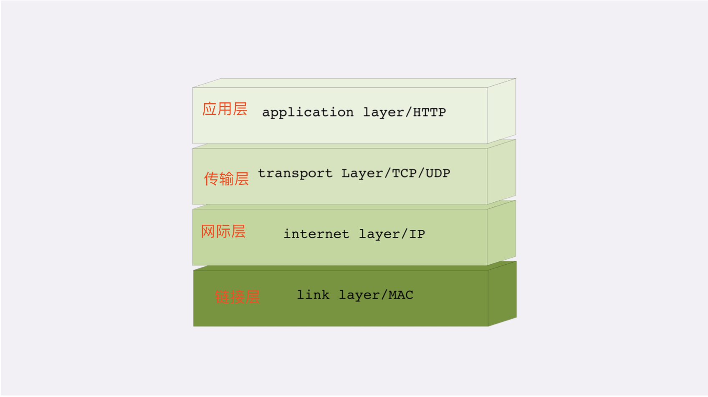
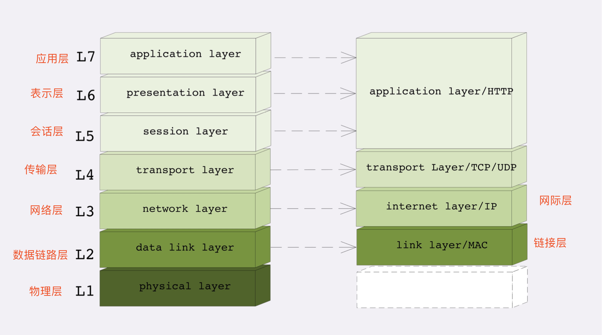
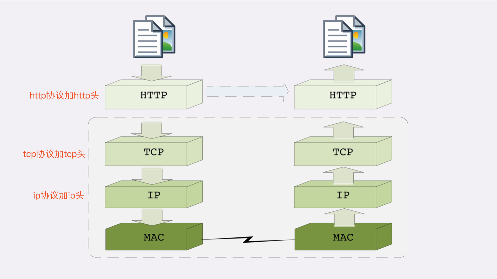

## TCP/IP模型

#### 链接层（link layer）
负责在以太网、wifi这样的底层网络上发送原始数据包，工作在网卡这个层次，使用MAC地址来标记网络上的设备。也叫MAC层。
传输单位：帧(frame)

#### 网际层、网络互联层（internet layer）
IP协议处在这一层。因为IP协议定义了‘IP地址’的概念，所以就可以在链接层的基础上，用IP地址取代MAC地址。把许许多多的局域网、广域网 连接成一个虚拟的巨大网络，在这个网络里找设备时只要把IP地址再“翻译”成MAC地址就可以了。
传输单位：包(packet)

#### 传输层（transport layer）
这个层次的协议就是保证数据在IP地址标记的两点之间‘可靠的’传输，TCP协议处在这层。还有UDP协议。传输单位：段 (segment)
+ TCP得先建立连接（三次握手）才能传输数据，且保证数据不丢失不重复。
+ UDP无状态，不用事先建立连接就可以任意发送数据，但不保证数据一定会发到对方。
+ TCP的数据是连续的“字节流”，有先后顺序，而UDP则是分散的小数 据包，是顺序发，乱序收。

#### 应用层（application layer）
有各种面向具体应用的协议。例如Telnet、SSH、FTP、SMTP等等，以及HTTP。
+ HTTP传输单位则是消息或报文(message)

## OSI模型

1. 第一层:物理层，网络的物理形式，例如电缆、光纤、网卡、集线器等等; 2. 第二层:数据链路层，它基本相当于TCP/IP的链接层;
3. 第三层:网络层，相当于TCP/IP里的网际层;
4. 第四层:传输层，相当于TCP/IP里的传输层;
5. 第五层:会话层，维护网络中的连接状态，即保持会话和同步;
6. 第六层:表示层，把数据转换为合适、可理解的语法和语义; 
7. 第七层:应用层，面向具体的应用传输数据。

## TCP/IP协议栈的工作方式
+ HTTP协议的传输过程就是通过协议栈逐层向下，每一层都添加本层的专有数据，层层打包，然后通过 下层发送出去。
+ 接收数据是则是相反的操作，从下往上穿过协议栈，逐层拆包，每层去掉本层的专有头，上层就会拿到自己
的数据。
+ 但下层的传输过程对于上层是完全“透明”的，上层也不需要关心下层的具体实现细节，所以就HTTP层次 来看，它不管下层是不是TCP/IP协议，看到的只是一个可靠的传输链路，只要把数据加上自己的头，对方就 能原样收到。
例子：HTTP利用TCP/IP传输一段HTML内容。

