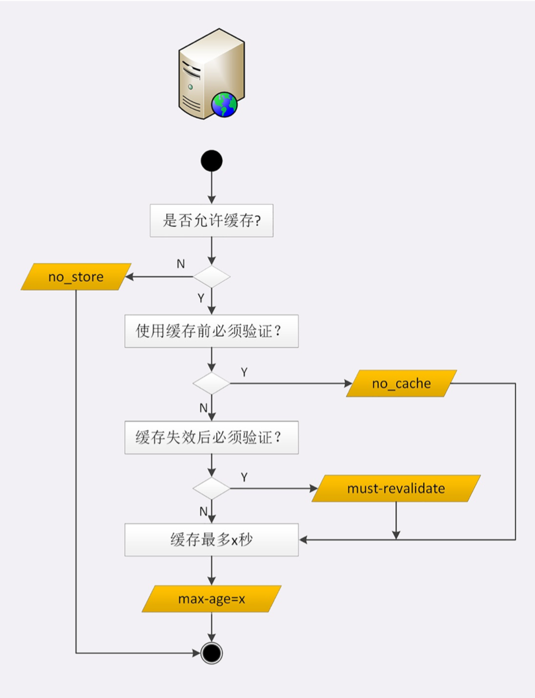
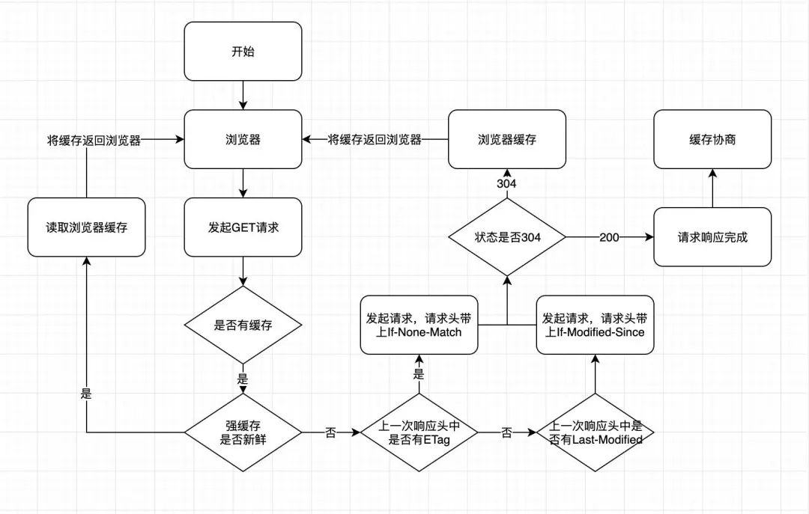

## HTTP的缓存控制
1. 浏览器发现缓存无数据，于是发送请求，向服务器获取资源; 
2. 服务器响应请求，返回资源，同时标记资源的有效期;
3. 浏览器缓存资源，等待下次重用

#### Cache-Control
服务器标记资源有效期使用的头字段是“Cache-Control”。
+ ``max-age=30`` 是HTTP缓存控制最常用的属性，30代表30s。
+ ``no_store`` **不允许缓存**，用于某些变化非常频繁的数据，例如秒杀页面。
+ ``no_cache`` **可以缓存**，但在使用之前必须要去服务器验证是否过期，是否有最新的版本;
+ ``must-revalidate`` 如果缓存不过期就可以继续使用，但过期 了如果还想用就必须去服务器验证。

#### 条件请求

##### 验证资源是否失效
常用的是``if-Modified-Since``和``If-None-Match``，收到304就可以复用缓存里的资源。

##### 验证资源是否被修改
验证资源是否被修改的条件有两个:``Last-modified``和``ETag``，需要服务器预先在响应报文里设
置，搭配条件请求使用;

[好文](https://mp.weixin.qq.com/s/z_iKW6LYtAXEy60bPmCKcQ)