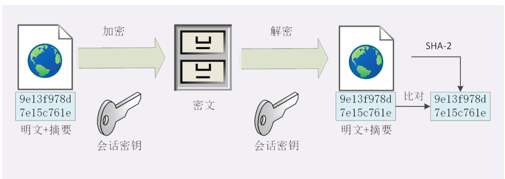

## HTTPS

#### 安全性
+ **机密性(Secrecy/Confidentiality)** 是指对数据的“保密”，只能由可信的人访问，对其他人是不可见的“秘密” **（加密）**
+ **完整性(Integrity，也叫一致性)** 是指数据在传输过程中没有被窜改，不多也不少，“完完整整”地保持着 原状。**（摘要算法）**
+ **身份认证(Authentication)** 是指确认对方的真实身份，也就是“证明你真的是你”，保证消息只能发送给 可信的人。**（数字签名）**
+ **不可否认(Non-repudiation/Undeniable)** 也叫不可抵赖，意思是不能否认已经发生过的行为

#### HTTPS
+ 协议名HTTPS
+ 默认端口号80 =》443
+ HTTP下层的传输协议由TCP/IP换成了SSL/TLS,由“HTTP over TCP/IP”变成了“HTTP over SSL/TLS”，让HTTP运行在了安全的SSL/TLS协议上，收发报文不再使用Socket API，而是调用专门的安全接口。

#### SSL/TLS
SSL即安全套接层(Secure Sockets Layer)，在OSI模型中处于第5层(会话层)

+ LS由记录协议、握手协议、警告协议、变更密码规范协议、扩展协议等几个子协议组成，综合使用了对称 加密、非对称加密、身份认证等许多密码学前沿技术。
+ 浏览器和服务器在使用TLS建立连接时需要选择一组恰当的加密算法来实现安全通信，这些算法的组合被称 为“密码套件”(cipher suite，也叫加密套件)。
+ 基本的形式是**密钥交换算法+签名算法+对称加密算法+摘要算法**

#### 对称加密和非对称加密
###### 对称加密
+ 加密和解密时使用的密钥都是同一个
+ 优点：快，安全
+ 致命缺点：如何把密钥安全地传递给对方，术语 叫“密钥交换”。

###### 非对称加密
公钥和私钥有个特别的“单向”性，虽然都可以用来加密解密，但公钥加密后只能用私钥解密，反过来，私 钥加密后也只能用公钥解密。

+ 公钥加密，私钥解密。
+ 优点：安全，公钥是任意分发的，解决密钥交换问题
+ 缺点：基于复杂的数学运算，慢。

###### 混合加密
综合对称加密和非对称加密。
+ 在通信刚开始的时候使用非对称算法，比如RSA、ECDHE，首先解决密钥交换的问题。
+ 然后用随机数产生对称算法使用的“会话密钥”(session key)，再用公钥加密。因为会话密钥很短，通 常只有16字节或32字节，所以慢一点也无所谓。
+ 对方拿到密文后用私钥解密，取出会话密钥。这样，双方就实现了对称密钥的安全交换，后续就不再使用非对称加密，全都使用对称加密。

#### 数字签名
###### 摘要算法
+ 为了实现安全性中的完整性，采用摘要算法。把原文“压缩”。服务器拿到后，把原文采用统一算法“压缩”，比对两份摘要。不一样即不安全。
+ 真正的完整性必须要建立在机密性之上，在混合加密系统里用会话密钥加密消息和摘要，这样黑客无法得知明文，也就没有办法动手脚了。

###### 数字签名
数字签名解决安全性中的身份认证和不可否认问题。
+ 数字签名的原理，就是把公钥私钥的用法反过来，之前是公钥加密、私钥解密，现在是私钥加密、公钥解密。
+ 你的私钥只加密原文的摘要，得到的数字签名很小，方便保管和传输。
+ 签名和公钥一样完全公开，任何人都可以获取。但这个签名只有用私钥对应的公钥才能解开，拿到摘要后，再比对原文验证完整性，就可以像签署文件一样证明消息确实是你发的。
+ 只要你和网站互相交换公钥，就可以用“签名”和“验签”来确认消息的真实性，因为私钥保密，黑客不能伪造签名，就能够保证通信双方的身份。

####  公钥的信任
+ 第三方 CA(Certificate Authority，证书认证机构)。
+ CA对公钥的签名认证也是有格式的，要包含序列号、 用途、颁发者、有效时间等等，把这些打成一个包再签名，完整地证明公钥关联的各种信息，形成“数字证 书”(Certificate)。
+ Root CA

