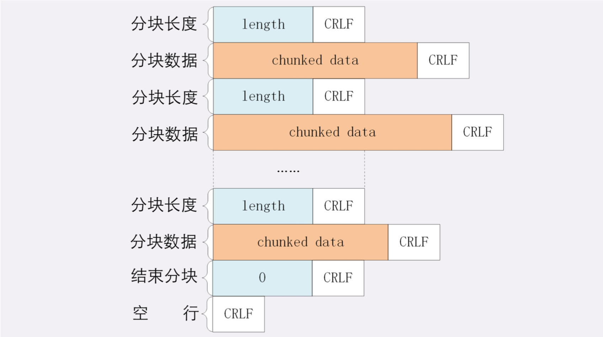
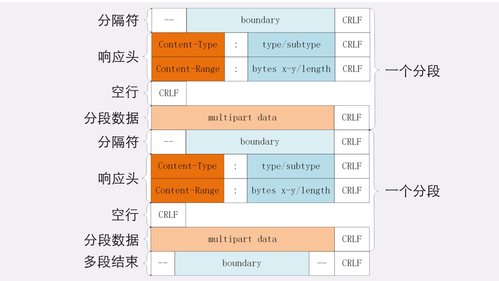

## HTTP传输大文件的方法

#### 数据压缩
请求头Accept-Encoding，gzip等压缩算法通常只对文本文件有较好的压缩率。所以不适用图片，视频等。

#### 分块传输
服务器把大文件分解成多个小块，把这些小块分批发给浏览器，浏览器收到后再组装复原。
+ HTTP协议里就是“chunked”分块传输编码，在响应报文里用头字
段``Transfer-Encoding: chunked``来表示，意思是报文里的body部分不是一次性发过来的，而是分成了许 多的块(chunk)逐个发送。
+ ``Transfer-Encoding: chunked``和``Content-Length``这两个字段是互斥的，也就是说响应报文里这两个 字段不能同时出现，一个响应报文的传输要么是长度已知，要么是长度未知(chunked)

1. 每个分块包含两个部分，长度头和数据块;
2. 长度头是以CRLF(回车换行，即\r\n)结尾的一行明文，用16进制数字表示长度; 
3. 数据块紧跟在长度头后，最后也用CRLF结尾，但数据不包含CRLF;
4. 最后用一个长度为0的块表示结束，即“0\r\n\r\n”。

#### 范围请求
HTTP协议为了满足获取一个大文件其中的片段数据，提出了“范围请求”(range requests)的概念，允许客户端在请求头里使 用专用字段来表示只获取文件的一部分，相当于是客户端的“化整为零”。
+ 服务器必须在响应头里使用字 段``Accept-Ranges: bytes``明确告知客户端:“我是支持范围请求的”。
+ 请求头``Range``是HTTP范围请求的专用字段，格式是``bytes=x-y``，其中的x和y是以字节为单位的数据范围。x、y表示的是“偏移量”，范围必须从0计数，例如前10个字节表示为“0-9”，第二个10字节表示 为“10-19”，而“0-10”实际上是前11个字节。

服务器收到Range字段后，需要做四件事。
1. 检查范围是否合法，如果范围越界，返回状态码416
2. 如果范围正确，服务器就可以根据Range头计算偏移量，读取文件的片段了，返回状态码``206 Partial Content``
3. 服务器要添加一个响应头字段Content-Range，告诉片段的实际偏移量和资源的总大小，格式 是``bytes x-y/length``，与Range头区别在没有“=”，范围后多了总长度。``bytes 0-10/100``
4. 把片段用TCP发给客户端.

看视频的拖拽进度需要范围请求，常用的下载工具里的多段下载、断点续传也是基于它实现的，要点是:
+ 先发个HEAD，看服务器是否支持范围请求，同时获取文件的大小;
+ 开N个线程，每个线程使用Range字段划分出各自负责下载的片段，发请求传输数据;
+ 下载意外中断也不怕，不必重头再来一遍，只要根据上次的下载记录，用Range请求剩下的那一部分就可 以了。

#### 多段数据
范围请求一次只获取一个片段，其实它还支持在Range头里使用多个“x-y”，一次性获取多个片 段数据。
+ 这种情况需要使用一种特殊的MIME类型:``multipart/byteranges``，表示报文的body是由多段字节序列 组成的，并且还要用一个参``boundary=xxx``给出段之间的分隔标记。

## 总结

1. 压缩HTML等文本文件是传输大文件最基本的方法;
2. 分块传输可以流式收发数据，节约内存和带宽，使用响应头字段“Transfer-Encoding: chunked”来表
示，分块的格式是16进制长度头+数据块;
3. 范围请求可以只获取部分数据，即“分块请求”，实现视频拖拽或者断点续传，使用请求头字
段“Range”和响应头字段“Content-Range”，响应状态码必须是206;
4. 也可以一次请求多个范围，这时候响应报文的数据类型是“multipart/byteranges”，body里的多个部分
会用boundary字符串分隔。