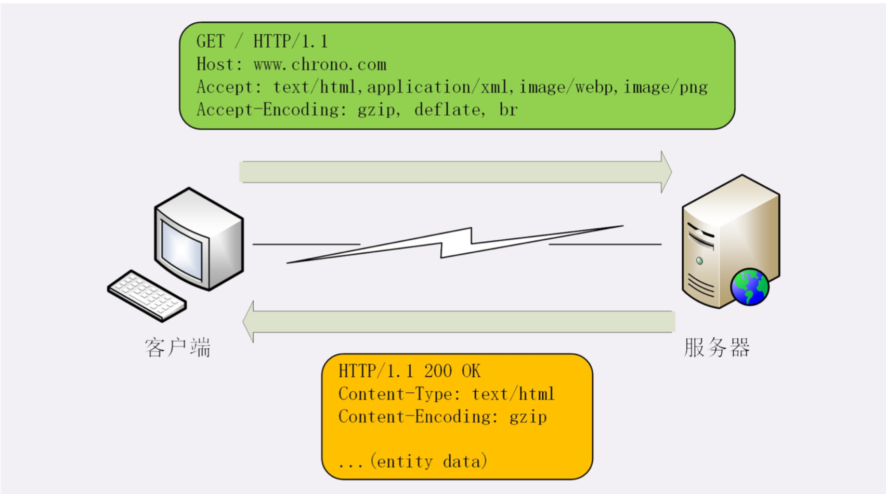
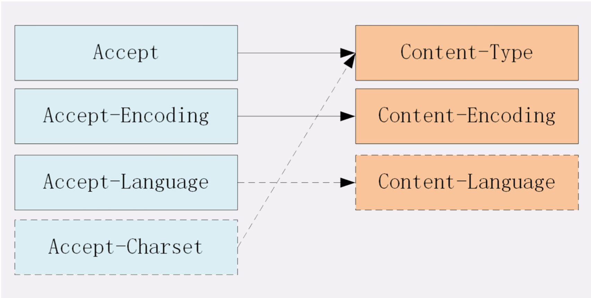

## HTTP的实体数据
在TCP/IP协议栈里，传输数据基本上都是“header+body”的格式。但TCP、UDP因为是传输层的协议，它 们不会关心body数据是什么，只要把数据发送到对方就算是完成了任务。

而HTTP协议则不同，它是应用层的协议，数据到达之后工作只能说是完成了一半，还必须要告诉上层应用 这是什么数据才行.

#### 数据类型与编码
##### MIME type
MIME是一个很大的标准规范，但HTTP只“顺手牵羊”取了其中的一部分，用来标记body的数据类型，这 就是我们平常总能听到的“MIME type”。
1. text:即文本格式的可读数据，我们最熟悉的应该就是text/html了，表示超文本文档，此外还有纯文本 text/plain、样式表text/css等
2. image:即图像文件，有image/gif、image/jpeg、image/png等。
3. audio/video:音频和视频数据，例如audio/mpeg、video/mp4等。
4. application:数据格式不固定，可能是文本也可能是二进制，必须由上层应用程序来解释。常见的有
application/json，application/javascript、application/pdf等，另外，如果实在是不知道数据是什么类 型，像刚才说的“黑盒”，就会是application/octet-stream，即不透明的二进制数据。

##### Encoding type
HTTP在传输时为了节约带宽，有时候还会压缩数据。“Encoding type”，告诉数据是用的什么编码格式，这样对方才能正确解压缩， 还原出原始的数据。
1. gzip:GNU zip压缩格式，也是互联网上最流行的压缩格式;
2. deflate:zlib(deflate)压缩格式，流行程度仅次于gzip;
3. br:一种专门为HTTP优化的新压缩算法(Brotli)。

## 数据类型使用的头字段
HTTP协议定义了两个Accept请求头字段和两个Content实体头字段，用于客户端和服务器进行“内容协 商”。也就是说，客户端用Accept头告诉服务器希望接收什么样的数据，而服务器用Content头告诉客户端 实际发送了什么样的数据。

##### Accept
Accept字段标记的是客户端可理解的MIME type，可以用“,”做分隔符列出多个类型，让服务器有更多的选择余地。例如：``Accept: text/html,application/xml;q=0.9,*/*;q=0.8``
它表示浏览器最希望使用的是HTML文件，权重是1，其次是XML文件，权重是0.9，最后是任意数据类型， 权重是0.8。服务器收到请求头后，就会计算权重，再根据自己的实际情况优先输出HTML或者XML。

##### Content-Type
服务器会在响应报文里用头字段Content-Type告诉实体数据的真实类型。例如:``Content-Type: application/json; charset=utf-8``

##### Accept-Encoding
Accept-Encoding字段标记的是客户端支持的压缩格式，例如上面说的gzip、deflate等，同样也可以 用“,”列出多个。``Accept-Encoding: gzip, deflate, br``

##### Content- Encoding
服务器可以选择其中一种来压缩数据，实际使用的压缩格式放在响应头字段Content- Encoding里。`` Content-Encoding: gzip``

##### Accept-Language
请求头里Accept-Language字段标记了客户端可理解的自然语言，也允许用“,”做分隔符列出多个类型，例如: ``Accept-Language: zh-CN,zh;q=0.9,en;q=0.8``

##### Content-Language
服务器应该在响应报文里用头字段Content-Language告诉客户端实体数据使用的实际语言类型:``Content-Language: zh-CN``

1. 数据类型表示实体数据的内容是什么，使用的是MIME type，相关的头字段是Accept和Content-Type;
2. 数据编码表示实体数据的压缩方式，相关的头字段是Accept-Encoding和Content-Encoding;
3. 语言类型表示实体数据的自然语言，相关的头字段是Accept-Language和Content-Language;
4. 字符集表示实体数据的编码方式，相关的头字段是Accept-Charset和Content-Type;
5. 客户端需要在请求头里使用Accept等头字段与服务器进行“内容协商”，要求服务器返回最合适的数 据;
6. Accept等头字段可以用“,”顺序列出多个可能的选项，还可以用“;q=”参数来精确指定权重。
