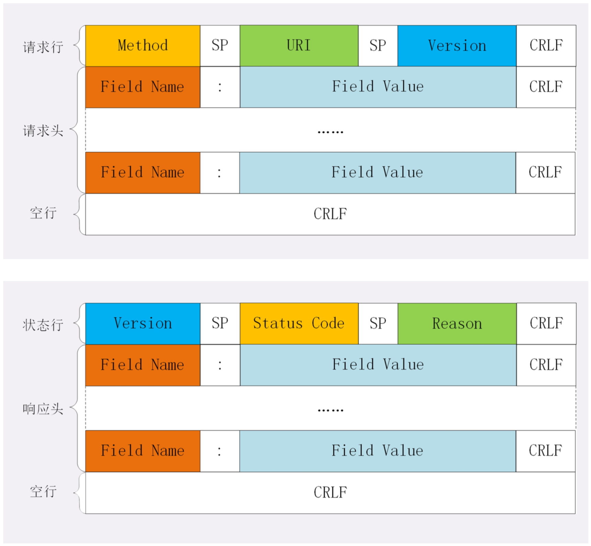

## HTTP报文
HTTP协议的请求报文和响应报文的结构基本相同，由三大部分组成:
+ 起始行(start line): 描述请求或响应的基本信息;
+ 头部字段集合(header): 使用key-value形式更详细地说明报文;
+ 消息正文(entity): 实际传输的数据，它不一定是纯文本，可以是图片、视频等二进制数据。 

这其中前两部分起始行和头部字段经常又合称为“请求头”或“响应头”，消息正文又称为“实体”，但 与“header”对应，很多时候就直接称为“body”。  
HTTP协议规定报文必须有header，但可以没有body，而且在header之后必须要有一个“空行”，也就 是“CRLF”，十六进制的“0D0A”。

#### 请求行
请求报文里的起始行也就是请求行(request line)，它简要地描述了客户端想要如何操作服务器端的资源。
1. 请求方法:是一个动词，如GET/POST，表示对资源的操作; 
2. 请求目标:通常是一个URI，标记了请求方法要操作的资源; 
3. 版本号:表示报文使用的HTTP协议版本。


#### 状态行
响应报文里的起始行，在这里它不叫“响应行”，而是叫“状态行”(status line)，意思是服务器响应的状态。
1. 版本号:表示报文使用的HTTP协议版本;
2. 状态码:一个三位数，用代码的形式表示处理的结果，比如200是成功，500是服务器错误; 
3. 原因:作为数字状态码补充，是更详细的解释文字，帮助人理解原因。
```js
HTTP/1.1 200 ok
```

#### 头部字段
请求行或状态行再加上头部字段集合就构成了HTTP报文里完整的请求头或响应头

+ 头部字段是key-value的形式，key和value之间用“:”分隔，最后用CRLF换行表示字段结束。
+ HTTP头字段非常灵活，不仅可以使用标准里的Host、Connection等已有头，也可以任意添加自定义头。

####  常用头字段
1. 通用字段:在请求头和响应头里都可以出现;
2. 请求字段:仅能出现在请求头里，进一步说明请求信息或者额外的附加条件;
3. 响应字段:仅能出现在响应头里，补充说明响应报文的信息;
4. 实体字段:它实际上属于通用字段，但专门描述body的额外信息。

##### Host
+ Host字段，它属于请求字段，只能出现在请求头里，它同时也是唯一一个HTTP/1.1规范里要 求必须出现的字段，也就是说，如果请求头里没有Host，那这就是一个错误的报文。
+ Host字段告诉服务器这个请求应该由哪个主机来处理，当一台计算机上托管了多个虚拟主机的时候，服务 器端就需要用Host字段来选择，有点像是一个简单的“路由重定向”。

##### User-Agent
User-Agent是请求字段，只出现在请求头里。它使用一个字符串来描述发起HTTP请求的客户端，服务器可 以依据它来返回最合适此浏览器显示的页面。

##### Date
Date字段是一个通用字段，但通常出现在响应头里，表示HTTP报文创建的时间，客户端可以使用这个时间 再搭配其他字段决定缓存策略。

##### Serve
Server字段是响应字段，只能出现在响应头里。它告诉客户端当前正在提供Web服务的软件名称和版本号。可以不填或者随便填。

##### Content-Length
Content-Length表示报文里body的长度，也就是请求头或响应头空行后面数 据的长度。服务器看到这个字段，就知道了后续有多少数据，可以直接接收。如果没有这个字段，那么 body就是不定长的，需要使用chunked方式分段传输。

