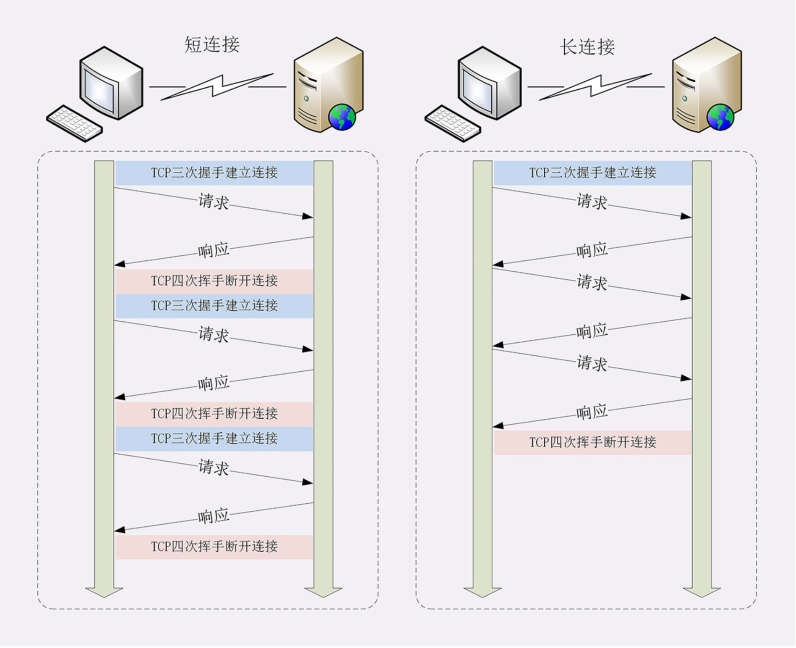
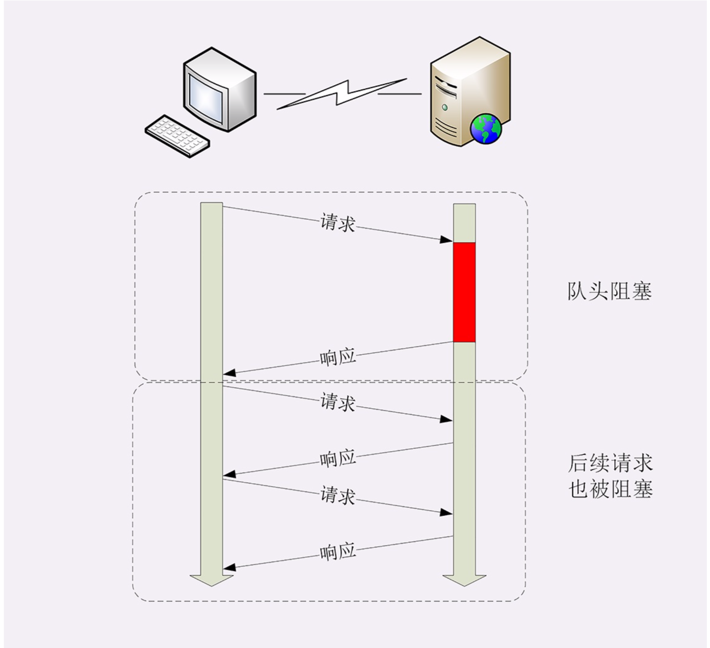

## HTTP的连接管理
由于HTTP的通信过程采用的是请求-应答”方式。所以http性能有短板，不算好。

#### 短链接
+ 客户端与服务器的整个连接过程很短暂，不会与服务器保持长时间的连接状态。
+ http底层的数据传输基于TCP/IP，每次发送请求前需要先与服务器建立连接，收到响应报文后会立即关闭连接。
+ 建立链接：TCP三次握手；关闭链接：TCP四次挥手。

每一次都要建立，关闭链接。非常浪费资源。

#### 长链接
不会每一次都建立，关闭链接。选在在合适的时候，关闭链接。

#### 连接相关的头字段
HTTP/1.1中的连接都会默认启用长连接。不需要用什么特殊的头字段指定，只要向服务器发送了第一次请求，后续的请求都会重复利用第一次打开的TCP连接，也就是 长连接，在这个连接上收发数据。
###### Connection
+ 客户端可以在请求头设置``Connection: keep-alive``，使用长链接。
+ 服务器支持长连接，它总会在响应报文里放一个``Connection: keep-alive``字段。
+ 客户端，可以在请求头里加上``Connection: close``字段，告诉服务器:“这次通信后就关闭连接”。
+ 通常服务器端不会主动关闭连接。

###### 关闭长链接
1. 客户端，可以在请求头里加上``Connection: close``字段。
2. 使用``keepalive_timeout``，设置长连接的超时时间。
3. 使用``keepalive_requests``，设置长连接上可发送的最大请求次数。

## 队头阻塞
+ “队头阻塞”与短连接和长连接无关，而是由HTTP基本的“请求-应答”模型所导致的。
+ HTTP规定报文必须是“一发一收”，这就形成了一个先进先出的“串行”队列。队列里的请求没有轻 重缓急的优先级，只有入队的先后顺序，排在最前面的请求被最优先处理。
+ 解决队头阻塞，在http1.1只能是在客户端并发长链接。（对服务器要求高）

#### 性能优化
因为“请求-应答”模型不能变，所以“队头阻塞”问题在HTTP/1.1里无法解决，只能缓解。
+ 并发连接（concurrent connections），也就是同时对一个域名发起多个长连接，用数量来解决质量的问题。（客户端建立多个链接）
+ 域名分片（domain sharding），多开几个域名，指向同一台服务器。

## HTTP/1.0 和 HTTP/1.1:
在HTTP/1.0 中每一次请求都需要建立一个 TCP 连接，请求结束后立即断开连接。 在HTTP/1.1 中，每一个连接都默认是长连接(persistent connection)。对于同一个 tcp 连接，允许一次发送多个 http1.1 请求，也就是说，不必等前一个响应收到，就可以发送下一个请求。这样就解决了 http1.0 的客户端的队头阻塞，而这也就是HTTP/1.1中管道(Pipeline)的概念了。 

但是，http1.1规定，服务器端的响应的发送要根据请求被接收的顺序排队，也就是说，先接收到的请求的响应也要先发送。这样造成的问题是，如果最先收到的请求的处理时间长的话，响应生成也慢，就会阻塞已经生成了的响应的发送。也会造成队头阻塞。 可见，http1.1 的队首阻塞发生在服务器端。

## HTTP/2 和 HTTP/1.1:
为了解决HTTP/1.1中的服务端队首阻塞，HTTP/2采用了二进制分帧 和 多路复用 等方法。
二进制分帧中，帧是HTTP/2数据通信的最小单位。在HTTP/1.1数据包是文本格式，而HTTP/2的数据包是二进制格式的，也就是二进制帧。采用帧可以将请求和响应的数据分割得更小，且二进制协议可以更高效解析。HTTP/2中，同域名下所有通信都在单个连接上完成，该连接可以承载任意数量的双向数据流。每个数据流都以消息的形式发送，而消息又由一个或多个帧组成。多个帧之间可以乱序发送，根据帧首部的流标识可以重新组装。 多路复用用以替代原来的序列和拥塞机制。在HTTP/1.1中，并发多个请求需要多个 TCP 链接，且单个域名有 6-8 个 TCP 链接请求限制。在HTTP/2中，同一域名下的所有通信在单个链接完成，仅占用一个 TCP 链接，且在这一个链接上可以并行请求和响应，互不干扰

